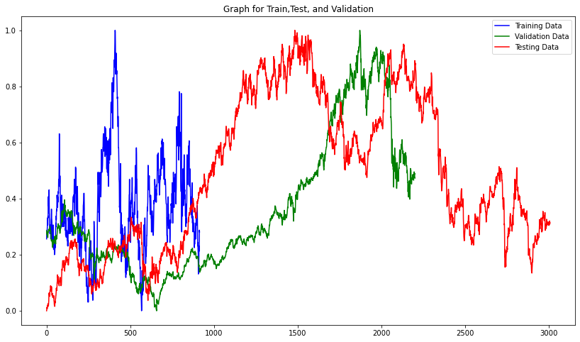
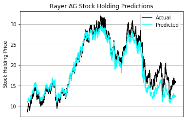
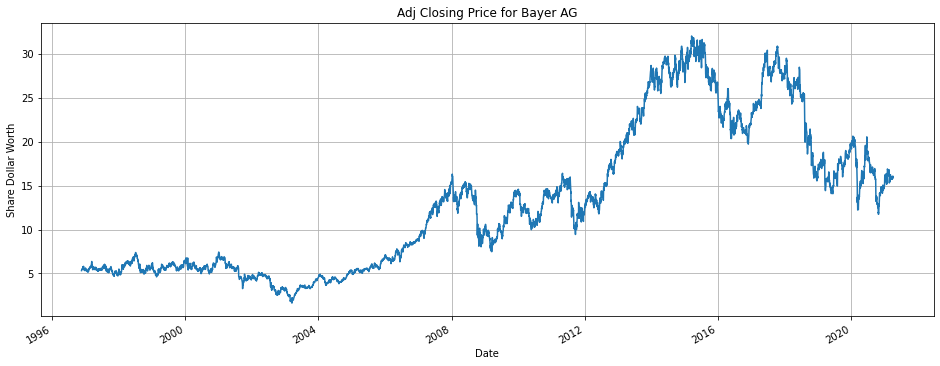
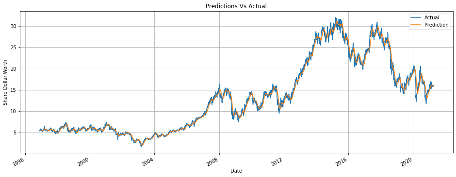
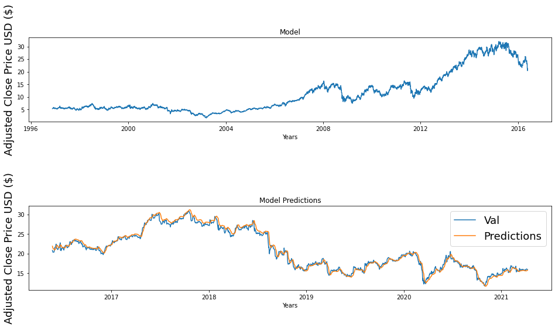

```python
from google.colab.drive import mount
mount("/content/drive/")
```

    Mounted at /content/drive/


<h1 style="color: red"> Bayer AG Stock Market Predictor</h1>
<p style="text-align: center"> Amna Ejaz and Jose M. Serra Jr.</p>
<p style="text-indent: 50px"> Using techinques taught in the Machine Learning course one will attempt a project which will use a regression algorithm to predict stock market values for BAYR index in the stock market. We will design, build, and test a regression algorithm with two validation tested algorithm one with past year (2020), and the other with the first few months of this year.</p>

<h1 style="color: Green">Importing libraries</h1>


```python
import pandas as pd
import numpy as np
import matplotlib.pyplot as mplplt
import tensorflow as tf
import tensorflow.keras
import tensorflow.keras.callbacks
from tensorflow.keras.callbacks import TensorBoard
from tensorflow.keras.models import Sequential
from tensorflow.keras.layers import Dense, Dropout,LSTM
from tensorflow.keras.wrappers.scikit_learn import KerasRegressor
from sklearn.datasets import make_regression
from sklearn.metrics import mean_squared_error
# scikit-learn bootstrap
from sklearn.utils import resample
```

<h1 style="color: maroon"> Reading the data file for BAYRY and NYStock </h1>


```python
BAYRY_stock_hist = pd.read_csv("C:\\Users\\19088\\Desktop\\Math3790\\Assignments\\Final_Project\\project_data_finance\\Data\\MASTERBAYRY.csv" , index_col="Date", parse_dates =True)
NYSE_stock_hist = pd.read_csv("C:\\Users\\19088\\Desktop\\Math3790\\Assignments\\Final_Project\\project_data_finance\\Data\\NYAIndexMaster.csv", index_col="Date", parse_dates =True)
```

<h3 style="color:brown"> Data Exploration for BAYRY Stock </h3>


```python
BAYRY_stock_hist.head(2)
```


<div>
<style scoped>
    .dataframe tbody tr th:only-of-type {
        vertical-align: middle;
    }

    .dataframe tbody tr th {
        vertical-align: top;
    }

    .dataframe thead th {
        text-align: right;
    }
</style>
<table border="1" class="dataframe">
  <thead>
    <tr style="text-align: right;">
      <th></th>
      <th>Open</th>
      <th>High</th>
      <th>Low</th>
      <th>Close</th>
      <th>Adj Close</th>
      <th>Volume</th>
    </tr>
    <tr>
      <th>Date</th>
      <th></th>
      <th></th>
      <th></th>
      <th></th>
      <th></th>
      <th></th>
    </tr>
  </thead>
  <tbody>
    <tr>
      <th>1996-11-18</th>
      <td>9.625</td>
      <td>9.6875</td>
      <td>9.50000</td>
      <td>9.625</td>
      <td>5.330023</td>
      <td>98400</td>
    </tr>
    <tr>
      <th>1996-11-19</th>
      <td>9.750</td>
      <td>9.7500</td>
      <td>9.53125</td>
      <td>9.750</td>
      <td>5.399244</td>
      <td>45200</td>
    </tr>
  </tbody>
</table>
</div>


```python
BAYRY_stock_hist.tail(2)
```


<div>
<style scoped>
    .dataframe tbody tr th:only-of-type {
        vertical-align: middle;
    }

    .dataframe tbody tr th {
        vertical-align: top;
    }

    .dataframe thead th {
        text-align: right;
    }
</style>
<table border="1" class="dataframe">
  <thead>
    <tr style="text-align: right;">
      <th></th>
      <th>Open</th>
      <th>High</th>
      <th>Low</th>
      <th>Close</th>
      <th>Adj Close</th>
      <th>Volume</th>
    </tr>
    <tr>
      <th>Date</th>
      <th></th>
      <th></th>
      <th></th>
      <th></th>
      <th></th>
      <th></th>
    </tr>
  </thead>
  <tbody>
    <tr>
      <th>2021-04-08</th>
      <td>15.97</td>
      <td>15.98</td>
      <td>15.90</td>
      <td>15.93</td>
      <td>15.93</td>
      <td>306000</td>
    </tr>
    <tr>
      <th>2021-04-09</th>
      <td>15.92</td>
      <td>15.94</td>
      <td>15.87</td>
      <td>15.92</td>
      <td>15.92</td>
      <td>207000</td>
    </tr>
  </tbody>
</table>
</div>


<h3 style="color: indigo">Changing name of columns for BAYRY stock</h3>


```python
BAYRY_stock_hist.columns = ["Open_BAYRY", "High_BAYRY","Low_BAYRY","Close_BAYRY", "Adj_Close_BAYRY","Volume_BAYRY"]
```


```python
BAYRY_stock_hist
```


<div>
<style scoped>
    .dataframe tbody tr th:only-of-type {
        vertical-align: middle;
    }

    .dataframe tbody tr th {
        vertical-align: top;
    }

    .dataframe thead th {
        text-align: right;
    }
</style>
<table border="1" class="dataframe">
  <thead>
    <tr style="text-align: right;">
      <th></th>
      <th>Open_BAYRY</th>
      <th>High_BAYRY</th>
      <th>Low_BAYRY</th>
      <th>Close_BAYRY</th>
      <th>Adj_Close_BAYRY</th>
      <th>Volume_BAYRY</th>
    </tr>
    <tr>
      <th>Date</th>
      <th></th>
      <th></th>
      <th></th>
      <th></th>
      <th></th>
      <th></th>
    </tr>
  </thead>
  <tbody>
    <tr>
      <th>1996-11-18</th>
      <td>9.625000</td>
      <td>9.687500</td>
      <td>9.50000</td>
      <td>9.625000</td>
      <td>5.330023</td>
      <td>98400</td>
    </tr>
    <tr>
      <th>1996-11-19</th>
      <td>9.750000</td>
      <td>9.750000</td>
      <td>9.53125</td>
      <td>9.750000</td>
      <td>5.399244</td>
      <td>45200</td>
    </tr>
    <tr>
      <th>1996-11-20</th>
      <td>9.750000</td>
      <td>9.812500</td>
      <td>9.62500</td>
      <td>9.750000</td>
      <td>5.399244</td>
      <td>32000</td>
    </tr>
    <tr>
      <th>1996-11-21</th>
      <td>9.781250</td>
      <td>9.812500</td>
      <td>9.65625</td>
      <td>9.781250</td>
      <td>5.416549</td>
      <td>54400</td>
    </tr>
    <tr>
      <th>1996-11-22</th>
      <td>9.812500</td>
      <td>9.843750</td>
      <td>9.68750</td>
      <td>9.812500</td>
      <td>5.433855</td>
      <td>32800</td>
    </tr>
    <tr>
      <th>...</th>
      <td>...</td>
      <td>...</td>
      <td>...</td>
      <td>...</td>
      <td>...</td>
      <td>...</td>
    </tr>
    <tr>
      <th>2021-04-05</th>
      <td>16.049999</td>
      <td>16.150000</td>
      <td>15.73000</td>
      <td>16.080000</td>
      <td>16.080000</td>
      <td>332800</td>
    </tr>
    <tr>
      <th>2021-04-06</th>
      <td>15.950000</td>
      <td>16.059999</td>
      <td>15.92000</td>
      <td>16.030001</td>
      <td>16.030001</td>
      <td>520200</td>
    </tr>
    <tr>
      <th>2021-04-07</th>
      <td>15.960000</td>
      <td>16.030001</td>
      <td>15.93000</td>
      <td>15.980000</td>
      <td>15.980000</td>
      <td>240400</td>
    </tr>
    <tr>
      <th>2021-04-08</th>
      <td>15.970000</td>
      <td>15.980000</td>
      <td>15.90000</td>
      <td>15.930000</td>
      <td>15.930000</td>
      <td>306000</td>
    </tr>
    <tr>
      <th>2021-04-09</th>
      <td>15.920000</td>
      <td>15.940000</td>
      <td>15.87000</td>
      <td>15.920000</td>
      <td>15.920000</td>
      <td>207000</td>
    </tr>
  </tbody>
</table>
<p>6138 rows × 6 columns</p>
</div>


###  Summary for BAYRY stock


```python
BAYRY_stock_hist.describe().T
```


<div>
<style scoped>
    .dataframe tbody tr th:only-of-type {
        vertical-align: middle;
    }

    .dataframe tbody tr th {
        vertical-align: top;
    }

    .dataframe thead th {
        text-align: right;
    }
</style>
<table border="1" class="dataframe">
  <thead>
    <tr style="text-align: right;">
      <th></th>
      <th>count</th>
      <th>mean</th>
      <th>std</th>
      <th>min</th>
      <th>25%</th>
      <th>50%</th>
      <th>75%</th>
      <th>max</th>
    </tr>
  </thead>
  <tbody>
    <tr>
      <th>Open_BAYRY</th>
      <td>6138.0</td>
      <td>17.081926</td>
      <td>8.846872</td>
      <td>2.712500</td>
      <td>9.968750</td>
      <td>15.438750</td>
      <td>21.734376</td>
      <td>3.906750e+01</td>
    </tr>
    <tr>
      <th>High_BAYRY</th>
      <td>6138.0</td>
      <td>17.222197</td>
      <td>8.880307</td>
      <td>2.812500</td>
      <td>10.062500</td>
      <td>15.615000</td>
      <td>21.904375</td>
      <td>3.919250e+01</td>
    </tr>
    <tr>
      <th>Low_BAYRY</th>
      <td>6138.0</td>
      <td>16.944139</td>
      <td>8.815163</td>
      <td>2.700000</td>
      <td>9.843750</td>
      <td>15.290000</td>
      <td>21.579375</td>
      <td>3.878750e+01</td>
    </tr>
    <tr>
      <th>Close_BAYRY</th>
      <td>6138.0</td>
      <td>17.092752</td>
      <td>8.853876</td>
      <td>2.810000</td>
      <td>9.968750</td>
      <td>15.460000</td>
      <td>21.690001</td>
      <td>3.899250e+01</td>
    </tr>
    <tr>
      <th>Adj_Close_BAYRY</th>
      <td>6138.0</td>
      <td>13.108723</td>
      <td>8.291310</td>
      <td>1.640303</td>
      <td>5.606907</td>
      <td>11.961944</td>
      <td>18.618596</td>
      <td>3.201624e+01</td>
    </tr>
    <tr>
      <th>Volume_BAYRY</th>
      <td>6138.0</td>
      <td>389853.176931</td>
      <td>569532.107592</td>
      <td>0.000000</td>
      <td>92100.000000</td>
      <td>216000.000000</td>
      <td>457200.000000</td>
      <td>1.143840e+07</td>
    </tr>
  </tbody>
</table>
</div>


```python
pd.DataFrame(BAYRY_stock_hist.dtypes).T
```


<div>
<style scoped>
    .dataframe tbody tr th:only-of-type {
        vertical-align: middle;
    }

    .dataframe tbody tr th {
        vertical-align: top;
    }

    .dataframe thead th {
        text-align: right;
    }
</style>
<table border="1" class="dataframe">
  <thead>
    <tr style="text-align: right;">
      <th></th>
      <th>Open_BAYRY</th>
      <th>High_BAYRY</th>
      <th>Low_BAYRY</th>
      <th>Close_BAYRY</th>
      <th>Adj_Close_BAYRY</th>
      <th>Volume_BAYRY</th>
    </tr>
  </thead>
  <tbody>
    <tr>
      <th>0</th>
      <td>float64</td>
      <td>float64</td>
      <td>float64</td>
      <td>float64</td>
      <td>float64</td>
      <td>int64</td>
    </tr>
  </tbody>
</table>
</div>


### Data exploration for NY stock


```python
NYSE_stock_hist.head(2)
```


<div>
<style scoped>
    .dataframe tbody tr th:only-of-type {
        vertical-align: middle;
    }

    .dataframe tbody tr th {
        vertical-align: top;
    }

    .dataframe thead th {
        text-align: right;
    }
</style>
<table border="1" class="dataframe">
  <thead>
    <tr style="text-align: right;">
      <th></th>
      <th>Open</th>
      <th>High</th>
      <th>Low</th>
      <th>Close</th>
      <th>Adj Close</th>
      <th>Volume</th>
    </tr>
    <tr>
      <th>Date</th>
      <th></th>
      <th></th>
      <th></th>
      <th></th>
      <th></th>
      <th></th>
    </tr>
  </thead>
  <tbody>
    <tr>
      <th>1996-11-18</th>
      <td>4122.700195</td>
      <td>4122.700195</td>
      <td>4122.700195</td>
      <td>4122.700195</td>
      <td>4122.700195</td>
      <td>0</td>
    </tr>
    <tr>
      <th>1996-11-19</th>
      <td>4142.790039</td>
      <td>4142.790039</td>
      <td>4142.790039</td>
      <td>4142.790039</td>
      <td>4142.790039</td>
      <td>0</td>
    </tr>
  </tbody>
</table>
</div>


```python
NYSE_stock_hist.tail(2)
```


<div>
<style scoped>
    .dataframe tbody tr th:only-of-type {
        vertical-align: middle;
    }

    .dataframe tbody tr th {
        vertical-align: top;
    }

    .dataframe thead th {
        text-align: right;
    }
</style>
<table border="1" class="dataframe">
  <thead>
    <tr style="text-align: right;">
      <th></th>
      <th>Open</th>
      <th>High</th>
      <th>Low</th>
      <th>Close</th>
      <th>Adj Close</th>
      <th>Volume</th>
    </tr>
    <tr>
      <th>Date</th>
      <th></th>
      <th></th>
      <th></th>
      <th></th>
      <th></th>
      <th></th>
    </tr>
  </thead>
  <tbody>
    <tr>
      <th>2021-04-08</th>
      <td>15838.849609</td>
      <td>15894.799805</td>
      <td>15812.370117</td>
      <td>15886.559570</td>
      <td>15886.559570</td>
      <td>3901910000</td>
    </tr>
    <tr>
      <th>2021-04-09</th>
      <td>15886.559570</td>
      <td>15956.379883</td>
      <td>15865.599609</td>
      <td>15956.370117</td>
      <td>15956.370117</td>
      <td>3634910000</td>
    </tr>
  </tbody>
</table>
</div>


<h3 style= "color: purple"> Changing names for NY stock columns</h3>


```python
NYSE_stock_hist.columns = ["Open_NYSE", "High_NYSE","Low_NYSE","Close_NYSE", "Adj_Close_NYSE","Volume_NYSE"]
```


```python
NYSE_stock_hist.describe().T
```


<div>
<style scoped>
    .dataframe tbody tr th:only-of-type {
        vertical-align: middle;
    }

    .dataframe tbody tr th {
        vertical-align: top;
    }

    .dataframe thead th {
        text-align: right;
    }
</style>
<table border="1" class="dataframe">
  <thead>
    <tr style="text-align: right;">
      <th></th>
      <th>count</th>
      <th>mean</th>
      <th>std</th>
      <th>min</th>
      <th>25%</th>
      <th>50%</th>
      <th>75%</th>
      <th>max</th>
    </tr>
  </thead>
  <tbody>
    <tr>
      <th>Open_NYSE</th>
      <td>6138.0</td>
      <td>8.461410e+03</td>
      <td>2.595586e+03</td>
      <td>4027.01001</td>
      <td>6.456175e+03</td>
      <td>7.919420e+03</td>
      <td>1.048545e+04</td>
      <td>1.588656e+04</td>
    </tr>
    <tr>
      <th>High_NYSE</th>
      <td>6138.0</td>
      <td>8.498326e+03</td>
      <td>2.608469e+03</td>
      <td>4027.01001</td>
      <td>6.469615e+03</td>
      <td>7.966495e+03</td>
      <td>1.053145e+04</td>
      <td>1.595638e+04</td>
    </tr>
    <tr>
      <th>Low_NYSE</th>
      <td>6138.0</td>
      <td>8.420711e+03</td>
      <td>2.581206e+03</td>
      <td>4027.01001</td>
      <td>6.443068e+03</td>
      <td>7.864465e+03</td>
      <td>1.043012e+04</td>
      <td>1.586560e+04</td>
    </tr>
    <tr>
      <th>Close_NYSE</th>
      <td>6138.0</td>
      <td>8.462213e+03</td>
      <td>2.595705e+03</td>
      <td>4027.01001</td>
      <td>6.456658e+03</td>
      <td>7.920335e+03</td>
      <td>1.048930e+04</td>
      <td>1.595637e+04</td>
    </tr>
    <tr>
      <th>Adj_Close_NYSE</th>
      <td>6138.0</td>
      <td>8.462213e+03</td>
      <td>2.595705e+03</td>
      <td>4027.01001</td>
      <td>6.456658e+03</td>
      <td>7.920335e+03</td>
      <td>1.048930e+04</td>
      <td>1.595637e+04</td>
    </tr>
    <tr>
      <th>Volume_NYSE</th>
      <td>6138.0</td>
      <td>2.740192e+09</td>
      <td>1.846064e+09</td>
      <td>0.00000</td>
      <td>1.337400e+09</td>
      <td>3.060185e+09</td>
      <td>3.905618e+09</td>
      <td>1.145623e+10</td>
    </tr>
  </tbody>
</table>
</div>


```python
pd.DataFrame(NYSE_stock_hist.dtypes).T
```


<div>
<style scoped>
    .dataframe tbody tr th:only-of-type {
        vertical-align: middle;
    }

    .dataframe tbody tr th {
        vertical-align: top;
    }

    .dataframe thead th {
        text-align: right;
    }
</style>
<table border="1" class="dataframe">
  <thead>
    <tr style="text-align: right;">
      <th></th>
      <th>Open_NYSE</th>
      <th>High_NYSE</th>
      <th>Low_NYSE</th>
      <th>Close_NYSE</th>
      <th>Adj_Close_NYSE</th>
      <th>Volume_NYSE</th>
    </tr>
  </thead>
  <tbody>
    <tr>
      <th>0</th>
      <td>float64</td>
      <td>float64</td>
      <td>float64</td>
      <td>float64</td>
      <td>float64</td>
      <td>int64</td>
    </tr>
  </tbody>
</table>
</div>


```python
NYSE_stock_hist
```


<div>
<style scoped>
    .dataframe tbody tr th:only-of-type {
        vertical-align: middle;
    }

    .dataframe tbody tr th {
        vertical-align: top;
    }

    .dataframe thead th {
        text-align: right;
    }
</style>
<table border="1" class="dataframe">
  <thead>
    <tr style="text-align: right;">
      <th></th>
      <th>Open_NYSE</th>
      <th>High_NYSE</th>
      <th>Low_NYSE</th>
      <th>Close_NYSE</th>
      <th>Adj_Close_NYSE</th>
      <th>Volume_NYSE</th>
    </tr>
    <tr>
      <th>Date</th>
      <th></th>
      <th></th>
      <th></th>
      <th></th>
      <th></th>
      <th></th>
    </tr>
  </thead>
  <tbody>
    <tr>
      <th>1996-11-18</th>
      <td>4122.700195</td>
      <td>4122.700195</td>
      <td>4122.700195</td>
      <td>4122.700195</td>
      <td>4122.700195</td>
      <td>0</td>
    </tr>
    <tr>
      <th>1996-11-19</th>
      <td>4142.790039</td>
      <td>4142.790039</td>
      <td>4142.790039</td>
      <td>4142.790039</td>
      <td>4142.790039</td>
      <td>0</td>
    </tr>
    <tr>
      <th>1996-11-20</th>
      <td>4153.359863</td>
      <td>4153.359863</td>
      <td>4153.359863</td>
      <td>4153.359863</td>
      <td>4153.359863</td>
      <td>0</td>
    </tr>
    <tr>
      <th>1996-11-21</th>
      <td>4147.549805</td>
      <td>4147.549805</td>
      <td>4147.549805</td>
      <td>4147.549805</td>
      <td>4147.549805</td>
      <td>0</td>
    </tr>
    <tr>
      <th>1996-11-22</th>
      <td>4173.029785</td>
      <td>4173.029785</td>
      <td>4173.029785</td>
      <td>4173.029785</td>
      <td>4173.029785</td>
      <td>0</td>
    </tr>
    <tr>
      <th>...</th>
      <td>...</td>
      <td>...</td>
      <td>...</td>
      <td>...</td>
      <td>...</td>
      <td>...</td>
    </tr>
    <tr>
      <th>2021-04-05</th>
      <td>15752.240234</td>
      <td>15882.099609</td>
      <td>15752.240234</td>
      <td>15870.339844</td>
      <td>15870.339844</td>
      <td>3999760000</td>
    </tr>
    <tr>
      <th>2021-04-06</th>
      <td>15870.339844</td>
      <td>15920.280273</td>
      <td>15842.250000</td>
      <td>15877.959961</td>
      <td>15877.959961</td>
      <td>4027880000</td>
    </tr>
    <tr>
      <th>2021-04-07</th>
      <td>15877.959961</td>
      <td>15905.250000</td>
      <td>15804.450195</td>
      <td>15838.849609</td>
      <td>15838.849609</td>
      <td>4112640000</td>
    </tr>
    <tr>
      <th>2021-04-08</th>
      <td>15838.849609</td>
      <td>15894.799805</td>
      <td>15812.370117</td>
      <td>15886.559570</td>
      <td>15886.559570</td>
      <td>3901910000</td>
    </tr>
    <tr>
      <th>2021-04-09</th>
      <td>15886.559570</td>
      <td>15956.379883</td>
      <td>15865.599609</td>
      <td>15956.370117</td>
      <td>15956.370117</td>
      <td>3634910000</td>
    </tr>
  </tbody>
</table>
<p>6138 rows × 6 columns</p>
</div>


<h3 style="color:purple"> Merge BAYRY and NY stock by date column <h3>


```python
master = BAYRY_stock_hist.merge(NYSE_stock_hist, how= "inner", on= "Date")
master.head(2)
```


<div>
<style scoped>
    .dataframe tbody tr th:only-of-type {
        vertical-align: middle;
    }

    .dataframe tbody tr th {
        vertical-align: top;
    }

    .dataframe thead th {
        text-align: right;
    }
</style>
<table border="1" class="dataframe">
  <thead>
    <tr style="text-align: right;">
      <th></th>
      <th>Open_BAYRY</th>
      <th>High_BAYRY</th>
      <th>Low_BAYRY</th>
      <th>Close_BAYRY</th>
      <th>Adj_Close_BAYRY</th>
      <th>Volume_BAYRY</th>
      <th>Open_NYSE</th>
      <th>High_NYSE</th>
      <th>Low_NYSE</th>
      <th>Close_NYSE</th>
      <th>Adj_Close_NYSE</th>
      <th>Volume_NYSE</th>
    </tr>
    <tr>
      <th>Date</th>
      <th></th>
      <th></th>
      <th></th>
      <th></th>
      <th></th>
      <th></th>
      <th></th>
      <th></th>
      <th></th>
      <th></th>
      <th></th>
      <th></th>
    </tr>
  </thead>
  <tbody>
    <tr>
      <th>1996-11-18</th>
      <td>9.625</td>
      <td>9.6875</td>
      <td>9.50000</td>
      <td>9.625</td>
      <td>5.330023</td>
      <td>98400</td>
      <td>4122.700195</td>
      <td>4122.700195</td>
      <td>4122.700195</td>
      <td>4122.700195</td>
      <td>4122.700195</td>
      <td>0</td>
    </tr>
    <tr>
      <th>1996-11-19</th>
      <td>9.750</td>
      <td>9.7500</td>
      <td>9.53125</td>
      <td>9.750</td>
      <td>5.399244</td>
      <td>45200</td>
      <td>4142.790039</td>
      <td>4142.790039</td>
      <td>4142.790039</td>
      <td>4142.790039</td>
      <td>4142.790039</td>
      <td>0</td>
    </tr>
  </tbody>
</table>
</div>


```python
master.tail(2)
```


<div>
<style scoped>
    .dataframe tbody tr th:only-of-type {
        vertical-align: middle;
    }

    .dataframe tbody tr th {
        vertical-align: top;
    }

    .dataframe thead th {
        text-align: right;
    }
</style>
<table border="1" class="dataframe">
  <thead>
    <tr style="text-align: right;">
      <th></th>
      <th>Open_BAYRY</th>
      <th>High_BAYRY</th>
      <th>Low_BAYRY</th>
      <th>Close_BAYRY</th>
      <th>Adj_Close_BAYRY</th>
      <th>Volume_BAYRY</th>
      <th>Open_NYSE</th>
      <th>High_NYSE</th>
      <th>Low_NYSE</th>
      <th>Close_NYSE</th>
      <th>Adj_Close_NYSE</th>
      <th>Volume_NYSE</th>
    </tr>
    <tr>
      <th>Date</th>
      <th></th>
      <th></th>
      <th></th>
      <th></th>
      <th></th>
      <th></th>
      <th></th>
      <th></th>
      <th></th>
      <th></th>
      <th></th>
      <th></th>
    </tr>
  </thead>
  <tbody>
    <tr>
      <th>2021-04-08</th>
      <td>15.97</td>
      <td>15.98</td>
      <td>15.90</td>
      <td>15.93</td>
      <td>15.93</td>
      <td>306000</td>
      <td>15838.849609</td>
      <td>15894.799805</td>
      <td>15812.370117</td>
      <td>15886.559570</td>
      <td>15886.559570</td>
      <td>3901910000</td>
    </tr>
    <tr>
      <th>2021-04-09</th>
      <td>15.92</td>
      <td>15.94</td>
      <td>15.87</td>
      <td>15.92</td>
      <td>15.92</td>
      <td>207000</td>
      <td>15886.559570</td>
      <td>15956.379883</td>
      <td>15865.599609</td>
      <td>15956.370117</td>
      <td>15956.370117</td>
      <td>3634910000</td>
    </tr>
  </tbody>
</table>
</div>


<h2 style="color:green"> Preprocessing Data </h2>

<p style="text-indent: 40px"> Split the data into three parts training set, validation set, and test set. <p>


```python
# Train set split the data by dates less then and equal to '2000-07-03'
train_df = master['1996-11-18':'2000-07-03']
# Validation split the data between dates greater then "2000-07-03 and less than 2009-04-30"
validation_df = master['2000-07-30' : '2009-04-30']
# Test set split the data from date greater and equal to "2009-04-30"
test_df =  master['2009-04-30':]
```


```python
test_df
```


<div>
<style scoped>
    .dataframe tbody tr th:only-of-type {
        vertical-align: middle;
    }

    .dataframe tbody tr th {
        vertical-align: top;
    }

    .dataframe thead th {
        text-align: right;
    }
</style>
<table border="1" class="dataframe">
  <thead>
    <tr style="text-align: right;">
      <th></th>
      <th>Open_BAYRY</th>
      <th>High_BAYRY</th>
      <th>Low_BAYRY</th>
      <th>Close_BAYRY</th>
      <th>Adj_Close_BAYRY</th>
      <th>Volume_BAYRY</th>
      <th>Open_NYSE</th>
      <th>High_NYSE</th>
      <th>Low_NYSE</th>
      <th>Close_NYSE</th>
      <th>Adj_Close_NYSE</th>
      <th>Volume_NYSE</th>
    </tr>
    <tr>
      <th>Date</th>
      <th></th>
      <th></th>
      <th></th>
      <th></th>
      <th></th>
      <th></th>
      <th></th>
      <th></th>
      <th></th>
      <th></th>
      <th></th>
      <th></th>
    </tr>
  </thead>
  <tbody>
    <tr>
      <th>2009-04-30</th>
      <td>12.450000</td>
      <td>12.512500</td>
      <td>12.3250</td>
      <td>12.365000</td>
      <td>8.578891</td>
      <td>118400</td>
      <td>5516.149902</td>
      <td>5622.229980</td>
      <td>5494.180176</td>
      <td>5513.359863</td>
      <td>5513.359863</td>
      <td>6862540000</td>
    </tr>
    <tr>
      <th>2009-05-01</th>
      <td>12.415000</td>
      <td>12.547500</td>
      <td>12.3025</td>
      <td>12.497500</td>
      <td>8.670820</td>
      <td>59600</td>
      <td>5513.359863</td>
      <td>5588.589844</td>
      <td>5492.870117</td>
      <td>5568.759766</td>
      <td>5568.759766</td>
      <td>5312170000</td>
    </tr>
    <tr>
      <th>2009-05-04</th>
      <td>12.662500</td>
      <td>12.830000</td>
      <td>12.6625</td>
      <td>12.792500</td>
      <td>8.875490</td>
      <td>332800</td>
      <td>5568.759766</td>
      <td>5801.600098</td>
      <td>5568.759766</td>
      <td>5800.220215</td>
      <td>5800.220215</td>
      <td>7038840000</td>
    </tr>
    <tr>
      <th>2009-05-05</th>
      <td>12.925000</td>
      <td>12.925000</td>
      <td>12.6250</td>
      <td>12.670000</td>
      <td>8.790502</td>
      <td>91600</td>
      <td>5800.220215</td>
      <td>5800.299805</td>
      <td>5726.879883</td>
      <td>5770.759766</td>
      <td>5770.759766</td>
      <td>6882860000</td>
    </tr>
    <tr>
      <th>2009-05-06</th>
      <td>12.677500</td>
      <td>12.722500</td>
      <td>12.5600</td>
      <td>12.637500</td>
      <td>8.767952</td>
      <td>181200</td>
      <td>5770.759766</td>
      <td>5900.759766</td>
      <td>5770.759766</td>
      <td>5890.549805</td>
      <td>5890.549805</td>
      <td>8555040000</td>
    </tr>
    <tr>
      <th>...</th>
      <td>...</td>
      <td>...</td>
      <td>...</td>
      <td>...</td>
      <td>...</td>
      <td>...</td>
      <td>...</td>
      <td>...</td>
      <td>...</td>
      <td>...</td>
      <td>...</td>
      <td>...</td>
    </tr>
    <tr>
      <th>2021-04-05</th>
      <td>16.049999</td>
      <td>16.150000</td>
      <td>15.7300</td>
      <td>16.080000</td>
      <td>16.080000</td>
      <td>332800</td>
      <td>15752.240234</td>
      <td>15882.099609</td>
      <td>15752.240234</td>
      <td>15870.339844</td>
      <td>15870.339844</td>
      <td>3999760000</td>
    </tr>
    <tr>
      <th>2021-04-06</th>
      <td>15.950000</td>
      <td>16.059999</td>
      <td>15.9200</td>
      <td>16.030001</td>
      <td>16.030001</td>
      <td>520200</td>
      <td>15870.339844</td>
      <td>15920.280273</td>
      <td>15842.250000</td>
      <td>15877.959961</td>
      <td>15877.959961</td>
      <td>4027880000</td>
    </tr>
    <tr>
      <th>2021-04-07</th>
      <td>15.960000</td>
      <td>16.030001</td>
      <td>15.9300</td>
      <td>15.980000</td>
      <td>15.980000</td>
      <td>240400</td>
      <td>15877.959961</td>
      <td>15905.250000</td>
      <td>15804.450195</td>
      <td>15838.849609</td>
      <td>15838.849609</td>
      <td>4112640000</td>
    </tr>
    <tr>
      <th>2021-04-08</th>
      <td>15.970000</td>
      <td>15.980000</td>
      <td>15.9000</td>
      <td>15.930000</td>
      <td>15.930000</td>
      <td>306000</td>
      <td>15838.849609</td>
      <td>15894.799805</td>
      <td>15812.370117</td>
      <td>15886.559570</td>
      <td>15886.559570</td>
      <td>3901910000</td>
    </tr>
    <tr>
      <th>2021-04-09</th>
      <td>15.920000</td>
      <td>15.940000</td>
      <td>15.8700</td>
      <td>15.920000</td>
      <td>15.920000</td>
      <td>207000</td>
      <td>15886.559570</td>
      <td>15956.379883</td>
      <td>15865.599609</td>
      <td>15956.370117</td>
      <td>15956.370117</td>
      <td>3634910000</td>
    </tr>
  </tbody>
</table>
<p>3007 rows × 12 columns</p>
</div>


<h3 style="color:teal">Split date column into month, year, and day</h3>


```python
'''
train_date,validation_df, test_date = train_df.pop('Date'), validation_df.pop('Date'), test_df.pop('Date')
def date_data_creator(df):
    df['Date'] = pd.to_datetime(df['Date'])
    df['year'] = df['Date'].dt.year
    df['month'] = df['Date'].dt.month
    df['day'] = df['Date'].dt.day
for i in [train_df,validation_df,test_df]:
    date_data_creator(i)
    '''
```


    "\ntrain_date,validation_df, test_date = train_df.pop('Date'), validation_df.pop('Date'), test_df.pop('Date')\ndef date_data_creator(df):\n    df['Date'] = pd.to_datetime(df['Date'])\n    df['year'] = df['Date'].dt.year\n    df['month'] = df['Date'].dt.month\n    df['day'] = df['Date'].dt.day\nfor i in [train_df,validation_df,test_df]:\n    date_data_creator(i)\n    "


```python
test_df
```


<div>
<style scoped>
    .dataframe tbody tr th:only-of-type {
        vertical-align: middle;
    }

    .dataframe tbody tr th {
        vertical-align: top;
    }

    .dataframe thead th {
        text-align: right;
    }
</style>
<table border="1" class="dataframe">
  <thead>
    <tr style="text-align: right;">
      <th></th>
      <th>Open_BAYRY</th>
      <th>High_BAYRY</th>
      <th>Low_BAYRY</th>
      <th>Close_BAYRY</th>
      <th>Adj_Close_BAYRY</th>
      <th>Volume_BAYRY</th>
      <th>Open_NYSE</th>
      <th>High_NYSE</th>
      <th>Low_NYSE</th>
      <th>Close_NYSE</th>
      <th>Adj_Close_NYSE</th>
      <th>Volume_NYSE</th>
    </tr>
    <tr>
      <th>Date</th>
      <th></th>
      <th></th>
      <th></th>
      <th></th>
      <th></th>
      <th></th>
      <th></th>
      <th></th>
      <th></th>
      <th></th>
      <th></th>
      <th></th>
    </tr>
  </thead>
  <tbody>
    <tr>
      <th>2009-04-30</th>
      <td>12.450000</td>
      <td>12.512500</td>
      <td>12.3250</td>
      <td>12.365000</td>
      <td>8.578891</td>
      <td>118400</td>
      <td>5516.149902</td>
      <td>5622.229980</td>
      <td>5494.180176</td>
      <td>5513.359863</td>
      <td>5513.359863</td>
      <td>6862540000</td>
    </tr>
    <tr>
      <th>2009-05-01</th>
      <td>12.415000</td>
      <td>12.547500</td>
      <td>12.3025</td>
      <td>12.497500</td>
      <td>8.670820</td>
      <td>59600</td>
      <td>5513.359863</td>
      <td>5588.589844</td>
      <td>5492.870117</td>
      <td>5568.759766</td>
      <td>5568.759766</td>
      <td>5312170000</td>
    </tr>
    <tr>
      <th>2009-05-04</th>
      <td>12.662500</td>
      <td>12.830000</td>
      <td>12.6625</td>
      <td>12.792500</td>
      <td>8.875490</td>
      <td>332800</td>
      <td>5568.759766</td>
      <td>5801.600098</td>
      <td>5568.759766</td>
      <td>5800.220215</td>
      <td>5800.220215</td>
      <td>7038840000</td>
    </tr>
    <tr>
      <th>2009-05-05</th>
      <td>12.925000</td>
      <td>12.925000</td>
      <td>12.6250</td>
      <td>12.670000</td>
      <td>8.790502</td>
      <td>91600</td>
      <td>5800.220215</td>
      <td>5800.299805</td>
      <td>5726.879883</td>
      <td>5770.759766</td>
      <td>5770.759766</td>
      <td>6882860000</td>
    </tr>
    <tr>
      <th>2009-05-06</th>
      <td>12.677500</td>
      <td>12.722500</td>
      <td>12.5600</td>
      <td>12.637500</td>
      <td>8.767952</td>
      <td>181200</td>
      <td>5770.759766</td>
      <td>5900.759766</td>
      <td>5770.759766</td>
      <td>5890.549805</td>
      <td>5890.549805</td>
      <td>8555040000</td>
    </tr>
    <tr>
      <th>...</th>
      <td>...</td>
      <td>...</td>
      <td>...</td>
      <td>...</td>
      <td>...</td>
      <td>...</td>
      <td>...</td>
      <td>...</td>
      <td>...</td>
      <td>...</td>
      <td>...</td>
      <td>...</td>
    </tr>
    <tr>
      <th>2021-04-05</th>
      <td>16.049999</td>
      <td>16.150000</td>
      <td>15.7300</td>
      <td>16.080000</td>
      <td>16.080000</td>
      <td>332800</td>
      <td>15752.240234</td>
      <td>15882.099609</td>
      <td>15752.240234</td>
      <td>15870.339844</td>
      <td>15870.339844</td>
      <td>3999760000</td>
    </tr>
    <tr>
      <th>2021-04-06</th>
      <td>15.950000</td>
      <td>16.059999</td>
      <td>15.9200</td>
      <td>16.030001</td>
      <td>16.030001</td>
      <td>520200</td>
      <td>15870.339844</td>
      <td>15920.280273</td>
      <td>15842.250000</td>
      <td>15877.959961</td>
      <td>15877.959961</td>
      <td>4027880000</td>
    </tr>
    <tr>
      <th>2021-04-07</th>
      <td>15.960000</td>
      <td>16.030001</td>
      <td>15.9300</td>
      <td>15.980000</td>
      <td>15.980000</td>
      <td>240400</td>
      <td>15877.959961</td>
      <td>15905.250000</td>
      <td>15804.450195</td>
      <td>15838.849609</td>
      <td>15838.849609</td>
      <td>4112640000</td>
    </tr>
    <tr>
      <th>2021-04-08</th>
      <td>15.970000</td>
      <td>15.980000</td>
      <td>15.9000</td>
      <td>15.930000</td>
      <td>15.930000</td>
      <td>306000</td>
      <td>15838.849609</td>
      <td>15894.799805</td>
      <td>15812.370117</td>
      <td>15886.559570</td>
      <td>15886.559570</td>
      <td>3901910000</td>
    </tr>
    <tr>
      <th>2021-04-09</th>
      <td>15.920000</td>
      <td>15.940000</td>
      <td>15.8700</td>
      <td>15.920000</td>
      <td>15.920000</td>
      <td>207000</td>
      <td>15886.559570</td>
      <td>15956.379883</td>
      <td>15865.599609</td>
      <td>15956.370117</td>
      <td>15956.370117</td>
      <td>3634910000</td>
    </tr>
  </tbody>
</table>
<p>3007 rows × 12 columns</p>
</div>


<h3 style="color:magenta"> Pop out column Adj_close from training and validation set</h3>


```python
try:
    train_target, validation_target, test_target = train_df.pop("Adj_Close_BAYRY"), validation_df.pop("Adj_Close_BAYRY"), test_df.pop("Adj_Close_BAYRY")
except:
    pass

```


```python
print(f"Test_df shape is {test_df.shape}")
```

    Test_df shape is (3007, 11)


<h3 style="color: black"> Min Max feature to normalize the variables </h3>


```python

```


```python
from sklearn.preprocessing import MinMaxScaler
X_scaler, X_validation_scaler, X_test_scaler = MinMaxScaler(), MinMaxScaler(), MinMaxScaler() 
Y_scaler, Y_validation_scaler, Y_test_scaler = MinMaxScaler(), MinMaxScaler(), MinMaxScaler()
```


```python
X, Y = X_scaler.fit_transform(train_df.values),Y_scaler.fit_transform(train_target.values.reshape(-1,1))
X_Validation, Y_Validation = X_validation_scaler.fit_transform(validation_df.values), Y_validation_scaler.fit_transform(validation_target.values.reshape(-1,1)) 
X_test, Y_test = X_test_scaler.fit_transform(test_df.values),Y_test_scaler.fit_transform(test_target.values.reshape(-1,1))
```

<h1 style="color:blueviolet"> Graph for the traning, validation, and test set </h1>


```python
%matplotlib inline

fig, ax = mplplt.subplots(figsize=(14,8))
ax.plot(Y,color='blue')
ax.set_title("Graph for Train,Test, and Validation")
ax.plot(Y_Validation, color= 'green')
ax.plot(Y_test,color='red')
ax.legend(("Training Data", "Validation Data", "Testing Data"))
mplplt.show()
```





```python
print(X_test.shape)
```

    (3007, 11)


<h2 style="color:cadetblue"> Regression model</h2>


```python
def base_model1():
    input_dim = X.shape[1]
    output_dim = 1
    model = Sequential()
    model.add(Dense(128, input_dim= input_dim,kernel_initializer ='normal', activation= 'sigmoid'))
    model.add(Dense(output_dim, activation='sigmoid'))
    model.compile(loss='mse', optimizer='adam', metrics=['MeanSquaredError',
        'AUC',])
    
    return model
```


```python
tb_callback = TensorBoard('./logs', update_freq=1)
model = KerasRegressor(build_fn=base_model1,  epochs=70, verbose=1, callbacks=[tb_callback])
```


```python
trained = model.fit(X,Y,validation_data=(X_Validation, Y_Validation),validation_batch_size=None)
y_hat = trained.model.predict(X_test)
```

    Epoch 1/70
     1/29 [>.............................] - ETA: 0s - loss: 0.0244 - mean_squared_error: 0.0244 - auc: 0.0000e+00WARNING:tensorflow:From C:\Users\19088\anaconda3\envs\Machine_learning\lib\site-packages\tensorflow\python\ops\summary_ops_v2.py:1277: stop (from tensorflow.python.eager.profiler) is deprecated and will be removed after 2020-07-01.
    Instructions for updating:
    use `tf.profiler.experimental.stop` instead.
     2/29 [=>............................] - ETA: 0s - loss: 0.0409 - mean_squared_error: 0.0409 - auc: 0.0000e+00WARNING:tensorflow:Callbacks method `on_train_batch_end` is slow compared to the batch time (batch time: 0.0020s vs `on_train_batch_end` time: 0.0510s). Check your callbacks.
    29/29 [==============================] - 1s 26ms/step - loss: 0.0257 - mean_squared_error: 0.0257 - auc: 0.8050 - val_loss: 0.0453 - val_mean_squared_error: 0.0453 - val_auc: 0.9952
    Epoch 2/70
    29/29 [==============================] - 0s 7ms/step - loss: 0.0207 - mean_squared_error: 0.0207 - auc: 0.9622 - val_loss: 0.0352 - val_mean_squared_error: 0.0352 - val_auc: 0.9970
    Epoch 3/70
    29/29 [==============================] - 0s 6ms/step - loss: 0.0168 - mean_squared_error: 0.0168 - auc: 0.8045 - val_loss: 0.0277 - val_mean_squared_error: 0.0277 - val_auc: 0.9980
    Epoch 4/70
    29/29 [==============================] - 0s 5ms/step - loss: 0.0137 - mean_squared_error: 0.0137 - auc: 0.9688 - val_loss: 0.0222 - val_mean_squared_error: 0.0222 - val_auc: 0.9966
    Epoch 5/70
    29/29 [==============================] - 0s 5ms/step - loss: 0.0111 - mean_squared_error: 0.0111 - auc: 0.9381 - val_loss: 0.0185 - val_mean_squared_error: 0.0185 - val_auc: 0.9977
    Epoch 6/70
    29/29 [==============================] - 0s 5ms/step - loss: 0.0089 - mean_squared_error: 0.0089 - auc: 0.9765 - val_loss: 0.0144 - val_mean_squared_error: 0.0144 - val_auc: 0.9982
    Epoch 7/70
    29/29 [==============================] - 0s 4ms/step - loss: 0.0069 - mean_squared_error: 0.0069 - auc: 0.9797 - val_loss: 0.0114 - val_mean_squared_error: 0.0114 - val_auc: 0.9982
    Epoch 8/70
    29/29 [==============================] - 0s 4ms/step - loss: 0.0053 - mean_squared_error: 0.0053 - auc: 0.9978 - val_loss: 0.0092 - val_mean_squared_error: 0.0092 - val_auc: 0.9977
    Epoch 9/70
    29/29 [==============================] - 0s 4ms/step - loss: 0.0039 - mean_squared_error: 0.0039 - auc: 0.9973 - val_loss: 0.0073 - val_mean_squared_error: 0.0073 - val_auc: 0.9980
    Epoch 10/70
    29/29 [==============================] - 0s 4ms/step - loss: 0.0029 - mean_squared_error: 0.0029 - auc: 0.9978 - val_loss: 0.0058 - val_mean_squared_error: 0.0058 - val_auc: 0.9986
    Epoch 11/70
    29/29 [==============================] - 0s 4ms/step - loss: 0.0021 - mean_squared_error: 0.0021 - auc: 0.9973 - val_loss: 0.0048 - val_mean_squared_error: 0.0048 - val_auc: 0.9982
    Epoch 12/70
    29/29 [==============================] - 0s 4ms/step - loss: 0.0015 - mean_squared_error: 0.0015 - auc: 0.9973 - val_loss: 0.0039 - val_mean_squared_error: 0.0039 - val_auc: 0.9991
    Epoch 13/70
    29/29 [==============================] - 0s 4ms/step - loss: 0.0011 - mean_squared_error: 0.0011 - auc: 0.9989 - val_loss: 0.0032 - val_mean_squared_error: 0.0032 - val_auc: 0.9989
    Epoch 14/70
    29/29 [==============================] - 0s 4ms/step - loss: 8.5001e-04 - mean_squared_error: 8.5001e-04 - auc: 1.0000 - val_loss: 0.0029 - val_mean_squared_error: 0.0029 - val_auc: 0.9995
    Epoch 15/70
    29/29 [==============================] - 0s 4ms/step - loss: 6.6800e-04 - mean_squared_error: 6.6800e-04 - auc: 0.9995 - val_loss: 0.0024 - val_mean_squared_error: 0.0024 - val_auc: 0.9995
    Epoch 16/70
    29/29 [==============================] - 0s 4ms/step - loss: 5.5470e-04 - mean_squared_error: 5.5470e-04 - auc: 0.9995 - val_loss: 0.0022 - val_mean_squared_error: 0.0022 - val_auc: 0.9986
    Epoch 17/70
    29/29 [==============================] - 0s 4ms/step - loss: 4.8155e-04 - mean_squared_error: 4.8155e-04 - auc: 0.9995 - val_loss: 0.0021 - val_mean_squared_error: 0.0021 - val_auc: 0.9998
    Epoch 18/70
    29/29 [==============================] - 0s 4ms/step - loss: 4.3876e-04 - mean_squared_error: 4.3876e-04 - auc: 1.0000 - val_loss: 0.0019 - val_mean_squared_error: 0.0019 - val_auc: 0.9991
    Epoch 19/70
    29/29 [==============================] - 0s 4ms/step - loss: 4.1296e-04 - mean_squared_error: 4.1296e-04 - auc: 0.9995 - val_loss: 0.0019 - val_mean_squared_error: 0.0019 - val_auc: 0.9991
    Epoch 20/70
    29/29 [==============================] - 0s 4ms/step - loss: 3.9859e-04 - mean_squared_error: 3.9859e-04 - auc: 0.9995 - val_loss: 0.0018 - val_mean_squared_error: 0.0018 - val_auc: 0.9998
    Epoch 21/70
    29/29 [==============================] - 0s 6ms/step - loss: 3.8696e-04 - mean_squared_error: 3.8696e-04 - auc: 1.0000 - val_loss: 0.0017 - val_mean_squared_error: 0.0017 - val_auc: 0.9998
    Epoch 22/70
    29/29 [==============================] - 0s 5ms/step - loss: 3.8394e-04 - mean_squared_error: 3.8394e-04 - auc: 0.9995 - val_loss: 0.0017 - val_mean_squared_error: 0.0017 - val_auc: 0.9998
    Epoch 23/70
    29/29 [==============================] - 0s 4ms/step - loss: 3.8157e-04 - mean_squared_error: 3.8157e-04 - auc: 0.9995 - val_loss: 0.0017 - val_mean_squared_error: 0.0017 - val_auc: 0.9995
    Epoch 24/70
    29/29 [==============================] - 0s 4ms/step - loss: 3.8686e-04 - mean_squared_error: 3.8686e-04 - auc: 0.9995 - val_loss: 0.0015 - val_mean_squared_error: 0.0015 - val_auc: 0.9998
    Epoch 25/70
    29/29 [==============================] - 0s 4ms/step - loss: 3.7869e-04 - mean_squared_error: 3.7869e-04 - auc: 0.9995 - val_loss: 0.0016 - val_mean_squared_error: 0.0016 - val_auc: 0.9995
    Epoch 26/70
    29/29 [==============================] - 0s 4ms/step - loss: 3.7875e-04 - mean_squared_error: 3.7875e-04 - auc: 0.9995 - val_loss: 0.0017 - val_mean_squared_error: 0.0017 - val_auc: 0.9995
    Epoch 27/70
    29/29 [==============================] - 0s 4ms/step - loss: 3.8063e-04 - mean_squared_error: 3.8063e-04 - auc: 0.9995 - val_loss: 0.0016 - val_mean_squared_error: 0.0016 - val_auc: 0.9993
    Epoch 28/70
    29/29 [==============================] - 0s 4ms/step - loss: 3.7568e-04 - mean_squared_error: 3.7568e-04 - auc: 1.0000 - val_loss: 0.0014 - val_mean_squared_error: 0.0014 - val_auc: 0.9998
    Epoch 29/70
    29/29 [==============================] - 0s 4ms/step - loss: 3.8740e-04 - mean_squared_error: 3.8740e-04 - auc: 0.9995 - val_loss: 0.0015 - val_mean_squared_error: 0.0015 - val_auc: 0.9993
    Epoch 30/70
    29/29 [==============================] - 0s 5ms/step - loss: 3.8389e-04 - mean_squared_error: 3.8389e-04 - auc: 0.9995 - val_loss: 0.0016 - val_mean_squared_error: 0.0016 - val_auc: 0.9993
    Epoch 31/70
    29/29 [==============================] - 0s 4ms/step - loss: 3.7600e-04 - mean_squared_error: 3.7600e-04 - auc: 0.9995 - val_loss: 0.0016 - val_mean_squared_error: 0.0016 - val_auc: 0.9993
    Epoch 32/70
    29/29 [==============================] - 0s 4ms/step - loss: 3.7555e-04 - mean_squared_error: 3.7555e-04 - auc: 0.9995 - val_loss: 0.0015 - val_mean_squared_error: 0.0015 - val_auc: 0.9993
    Epoch 33/70
    29/29 [==============================] - 0s 4ms/step - loss: 3.7787e-04 - mean_squared_error: 3.7787e-04 - auc: 0.9995 - val_loss: 0.0016 - val_mean_squared_error: 0.0016 - val_auc: 0.9993
    Epoch 34/70
    29/29 [==============================] - 0s 4ms/step - loss: 3.7299e-04 - mean_squared_error: 3.7299e-04 - auc: 0.9995 - val_loss: 0.0015 - val_mean_squared_error: 0.0015 - val_auc: 0.9993
    Epoch 35/70
    29/29 [==============================] - 0s 4ms/step - loss: 3.7476e-04 - mean_squared_error: 3.7476e-04 - auc: 0.9995 - val_loss: 0.0017 - val_mean_squared_error: 0.0017 - val_auc: 0.9995
    Epoch 36/70
    29/29 [==============================] - 0s 5ms/step - loss: 3.7917e-04 - mean_squared_error: 3.7917e-04 - auc: 0.9995 - val_loss: 0.0018 - val_mean_squared_error: 0.0018 - val_auc: 0.9995
    Epoch 37/70
    29/29 [==============================] - 0s 5ms/step - loss: 3.7419e-04 - mean_squared_error: 3.7419e-04 - auc: 0.9995 - val_loss: 0.0016 - val_mean_squared_error: 0.0016 - val_auc: 0.9995
    Epoch 38/70
    29/29 [==============================] - 0s 4ms/step - loss: 3.7215e-04 - mean_squared_error: 3.7215e-04 - auc: 0.9995 - val_loss: 0.0017 - val_mean_squared_error: 0.0017 - val_auc: 0.9995
    Epoch 39/70
    29/29 [==============================] - 0s 4ms/step - loss: 3.7375e-04 - mean_squared_error: 3.7375e-04 - auc: 0.9995 - val_loss: 0.0015 - val_mean_squared_error: 0.0015 - val_auc: 0.9993
    Epoch 40/70
    29/29 [==============================] - 0s 4ms/step - loss: 3.7926e-04 - mean_squared_error: 3.7926e-04 - auc: 0.9995 - val_loss: 0.0017 - val_mean_squared_error: 0.0017 - val_auc: 0.9995
    Epoch 41/70
    29/29 [==============================] - 0s 4ms/step - loss: 3.7585e-04 - mean_squared_error: 3.7585e-04 - auc: 0.9995 - val_loss: 0.0015 - val_mean_squared_error: 0.0015 - val_auc: 0.9993
    Epoch 42/70
    29/29 [==============================] - 0s 5ms/step - loss: 3.9656e-04 - mean_squared_error: 3.9656e-04 - auc: 0.9995 - val_loss: 0.0016 - val_mean_squared_error: 0.0016 - val_auc: 0.9995
    Epoch 43/70
    29/29 [==============================] - 0s 6ms/step - loss: 3.6955e-04 - mean_squared_error: 3.6955e-04 - auc: 0.9995 - val_loss: 0.0015 - val_mean_squared_error: 0.0015 - val_auc: 0.9993
    Epoch 44/70
    29/29 [==============================] - 0s 6ms/step - loss: 3.6863e-04 - mean_squared_error: 3.6863e-04 - auc: 0.9995 - val_loss: 0.0018 - val_mean_squared_error: 0.0018 - val_auc: 0.9995
    Epoch 45/70
    29/29 [==============================] - 0s 5ms/step - loss: 3.7568e-04 - mean_squared_error: 3.7568e-04 - auc: 0.9995 - val_loss: 0.0018 - val_mean_squared_error: 0.0018 - val_auc: 0.9995
    Epoch 46/70
    29/29 [==============================] - 0s 4ms/step - loss: 3.7509e-04 - mean_squared_error: 3.7509e-04 - auc: 0.9995 - val_loss: 0.0015 - val_mean_squared_error: 0.0015 - val_auc: 0.9993
    Epoch 47/70
    29/29 [==============================] - 0s 4ms/step - loss: 3.6922e-04 - mean_squared_error: 3.6922e-04 - auc: 0.9995 - val_loss: 0.0015 - val_mean_squared_error: 0.0015 - val_auc: 0.9993
    Epoch 48/70
    29/29 [==============================] - 0s 4ms/step - loss: 3.6932e-04 - mean_squared_error: 3.6932e-04 - auc: 0.9995 - val_loss: 0.0016 - val_mean_squared_error: 0.0016 - val_auc: 0.9995
    Epoch 49/70
    29/29 [==============================] - 0s 4ms/step - loss: 3.6974e-04 - mean_squared_error: 3.6974e-04 - auc: 0.9995 - val_loss: 0.0015 - val_mean_squared_error: 0.0015 - val_auc: 1.0000
    Epoch 50/70
    29/29 [==============================] - 0s 6ms/step - loss: 3.6895e-04 - mean_squared_error: 3.6895e-04 - auc: 0.9995 - val_loss: 0.0015 - val_mean_squared_error: 0.0015 - val_auc: 0.9993
    Epoch 51/70
    29/29 [==============================] - 0s 5ms/step - loss: 3.6753e-04 - mean_squared_error: 3.6753e-04 - auc: 0.9995 - val_loss: 0.0015 - val_mean_squared_error: 0.0015 - val_auc: 0.9993
    Epoch 52/70
    29/29 [==============================] - 0s 7ms/step - loss: 3.7145e-04 - mean_squared_error: 3.7145e-04 - auc: 1.0000 - val_loss: 0.0015 - val_mean_squared_error: 0.0015 - val_auc: 0.9998
    Epoch 53/70
    29/29 [==============================] - 0s 5ms/step - loss: 3.7533e-04 - mean_squared_error: 3.7533e-04 - auc: 1.0000 - val_loss: 0.0014 - val_mean_squared_error: 0.0014 - val_auc: 0.9998
    Epoch 54/70
    29/29 [==============================] - 0s 4ms/step - loss: 3.6990e-04 - mean_squared_error: 3.6990e-04 - auc: 1.0000 - val_loss: 0.0015 - val_mean_squared_error: 0.0015 - val_auc: 0.9993
    Epoch 55/70
    29/29 [==============================] - 0s 4ms/step - loss: 3.6998e-04 - mean_squared_error: 3.6998e-04 - auc: 1.0000 - val_loss: 0.0017 - val_mean_squared_error: 0.0017 - val_auc: 0.9995
    Epoch 56/70
    29/29 [==============================] - 0s 5ms/step - loss: 3.7009e-04 - mean_squared_error: 3.7009e-04 - auc: 0.9995 - val_loss: 0.0017 - val_mean_squared_error: 0.0017 - val_auc: 0.9995
    Epoch 57/70
    29/29 [==============================] - 0s 4ms/step - loss: 3.6990e-04 - mean_squared_error: 3.6990e-04 - auc: 0.9995 - val_loss: 0.0016 - val_mean_squared_error: 0.0016 - val_auc: 0.9995
    Epoch 58/70
    29/29 [==============================] - 0s 4ms/step - loss: 3.6994e-04 - mean_squared_error: 3.6994e-04 - auc: 0.9995 - val_loss: 0.0015 - val_mean_squared_error: 0.0015 - val_auc: 0.9998
    Epoch 59/70
    29/29 [==============================] - 0s 4ms/step - loss: 3.8526e-04 - mean_squared_error: 3.8526e-04 - auc: 0.9995 - val_loss: 0.0016 - val_mean_squared_error: 0.0016 - val_auc: 0.9995
    Epoch 60/70
    29/29 [==============================] - 0s 5ms/step - loss: 3.6700e-04 - mean_squared_error: 3.6700e-04 - auc: 0.9995 - val_loss: 0.0016 - val_mean_squared_error: 0.0016 - val_auc: 0.9993
    Epoch 61/70
    29/29 [==============================] - 0s 4ms/step - loss: 3.7198e-04 - mean_squared_error: 3.7198e-04 - auc: 0.9995 - val_loss: 0.0014 - val_mean_squared_error: 0.0014 - val_auc: 0.9998
    Epoch 62/70
    29/29 [==============================] - 0s 4ms/step - loss: 3.8167e-04 - mean_squared_error: 3.8167e-04 - auc: 0.9995 - val_loss: 0.0018 - val_mean_squared_error: 0.0018 - val_auc: 0.9995
    Epoch 63/70
    29/29 [==============================] - 0s 4ms/step - loss: 3.8490e-04 - mean_squared_error: 3.8490e-04 - auc: 0.9989 - val_loss: 0.0015 - val_mean_squared_error: 0.0015 - val_auc: 0.9998
    Epoch 64/70
    29/29 [==============================] - 0s 4ms/step - loss: 3.7367e-04 - mean_squared_error: 3.7367e-04 - auc: 1.0000 - val_loss: 0.0017 - val_mean_squared_error: 0.0017 - val_auc: 0.9995
    Epoch 65/70
    29/29 [==============================] - 0s 4ms/step - loss: 3.7008e-04 - mean_squared_error: 3.7008e-04 - auc: 0.9995 - val_loss: 0.0014 - val_mean_squared_error: 0.0014 - val_auc: 0.9998
    Epoch 66/70
    29/29 [==============================] - 0s 4ms/step - loss: 3.6655e-04 - mean_squared_error: 3.6655e-04 - auc: 0.9995 - val_loss: 0.0015 - val_mean_squared_error: 0.0015 - val_auc: 1.0000
    Epoch 67/70
    29/29 [==============================] - 0s 4ms/step - loss: 3.6412e-04 - mean_squared_error: 3.6412e-04 - auc: 0.9995 - val_loss: 0.0016 - val_mean_squared_error: 0.0016 - val_auc: 0.9993
    Epoch 68/70
    29/29 [==============================] - 0s 4ms/step - loss: 3.6837e-04 - mean_squared_error: 3.6837e-04 - auc: 1.0000 - val_loss: 0.0015 - val_mean_squared_error: 0.0015 - val_auc: 0.9993
    Epoch 69/70
    29/29 [==============================] - 0s 4ms/step - loss: 3.6115e-04 - mean_squared_error: 3.6115e-04 - auc: 0.9995 - val_loss: 0.0017 - val_mean_squared_error: 0.0017 - val_auc: 0.9995
    Epoch 70/70
    29/29 [==============================] - 0s 4ms/step - loss: 3.6054e-04 - mean_squared_error: 3.6054e-04 - auc: 0.9995 - val_loss: 0.0016 - val_mean_squared_error: 0.0016 - val_auc: 0.9995


```python
%reload_ext tensorboard
```


```python
%tensorboard --logdir {'./logs'} --host=127.0.0.1
```


    Reusing TensorBoard on port 6006 (pid 4236), started 2 days, 2:26:39 ago. (Use '!kill 4236' to kill it.)


<iframe id="tensorboard-frame-55c984d11bad9dd1" width="100%" height="800" frameborder="0">
</iframe>
<script>
  (function() {
    const frame = document.getElementById("tensorboard-frame-55c984d11bad9dd1");
    const url = new URL("/", window.location);
    const port = 6006;
    if (port) {
      url.port = port;
    }
    frame.src = url;
  })();
</script>


```python
!taskkill /pid 13680 /f
```

    ERROR: The process "13680" not found.


```python

```


```python
callable_history = pd.DataFrame(trained.history)
```


<div>
<style scoped>
    .dataframe tbody tr th:only-of-type {
        vertical-align: middle;
    }

    .dataframe tbody tr th {
        vertical-align: top;
    }

    .dataframe thead th {
        text-align: right;
    }
</style>
<table border="1" class="dataframe">
  <thead>
    <tr style="text-align: right;">
      <th></th>
      <th>loss</th>
      <th>mean_squared_error</th>
      <th>auc</th>
      <th>val_loss</th>
      <th>val_mean_squared_error</th>
      <th>val_auc</th>
    </tr>
  </thead>
  <tbody>
    <tr>
      <th>0</th>
      <td>0.025662</td>
      <td>0.025662</td>
      <td>0.805038</td>
      <td>0.045338</td>
      <td>0.045338</td>
      <td>0.995225</td>
    </tr>
    <tr>
      <th>1</th>
      <td>0.020668</td>
      <td>0.020668</td>
      <td>0.962212</td>
      <td>0.035202</td>
      <td>0.035202</td>
      <td>0.997044</td>
    </tr>
    <tr>
      <th>2</th>
      <td>0.016848</td>
      <td>0.016848</td>
      <td>0.804491</td>
      <td>0.027713</td>
      <td>0.027713</td>
      <td>0.997954</td>
    </tr>
    <tr>
      <th>3</th>
      <td>0.013707</td>
      <td>0.013707</td>
      <td>0.968784</td>
      <td>0.022201</td>
      <td>0.022201</td>
      <td>0.996589</td>
    </tr>
    <tr>
      <th>4</th>
      <td>0.011073</td>
      <td>0.011073</td>
      <td>0.938116</td>
      <td>0.018464</td>
      <td>0.018464</td>
      <td>0.997726</td>
    </tr>
    <tr>
      <th>...</th>
      <td>...</td>
      <td>...</td>
      <td>...</td>
      <td>...</td>
      <td>...</td>
      <td>...</td>
    </tr>
    <tr>
      <th>65</th>
      <td>0.000367</td>
      <td>0.000367</td>
      <td>0.999452</td>
      <td>0.001523</td>
      <td>0.001523</td>
      <td>1.000000</td>
    </tr>
    <tr>
      <th>66</th>
      <td>0.000364</td>
      <td>0.000364</td>
      <td>0.999452</td>
      <td>0.001567</td>
      <td>0.001567</td>
      <td>0.999318</td>
    </tr>
    <tr>
      <th>67</th>
      <td>0.000368</td>
      <td>0.000368</td>
      <td>1.000000</td>
      <td>0.001543</td>
      <td>0.001543</td>
      <td>0.999318</td>
    </tr>
    <tr>
      <th>68</th>
      <td>0.000361</td>
      <td>0.000361</td>
      <td>0.999452</td>
      <td>0.001698</td>
      <td>0.001698</td>
      <td>0.999545</td>
    </tr>
    <tr>
      <th>69</th>
      <td>0.000361</td>
      <td>0.000361</td>
      <td>0.999452</td>
      <td>0.001589</td>
      <td>0.001589</td>
      <td>0.999545</td>
    </tr>
  </tbody>
</table>
<p>70 rows × 6 columns</p>
</div>


<h3 style="color:Chocolate">Graph for mean squared error</h3>

<h3 style="color:Crimson">Graph for accuracy</h3>


```python
%matplotlib inline
plot = pd.DataFrame(trained.history)
fig, [ax, ax1] = mplplt.subplots(nrows=2, figsize=(8,8))
ax.plot(plot["auc"])
ax.plot(plot["val_auc"])
ax.grid(True)
ax.legend(["Training AUC","Validation AUC"])
ax.set_title("Area Under the Curve")
ax1.plot(plot["mean_squared_error"])
ax1.plot(plot["val_mean_squared_error"])
ax1.legend(["Training Mean Squared Error", "Validation Mean Squared Error"])
ax1.grid(True)
ax1.set_title("Mean Square Error")
mplplt.subplots_adjust(left=None, bottom=.25, right=None, top=1,
                wspace=1, hspace=1)
mplplt.show()
```


###### Calculate the mean square error


```python
RMSE = mean_squared_error(y_hat,Y_test, squared= False)
RMSE
```


    0.07678315059855478


# Prediction


```python
X_test_inverse, Y_test_predict, Y_test_inverse = X_test_scaler.inverse_transform(X_test),Y_test_scaler.inverse_transform(y_hat), Y_test_scaler.inverse_transform(Y_test)
```


```python
for i,j in zip(Y_test_predict,Y_test_inverse):
    print(i,j)
```

    [10.948709] [8.578891]
    [10.966354] [8.67082]
    [11.069277] [8.87549]
    [11.0900545] [8.790502]
    [11.028228] [8.767952]
    [11.059435] [8.787033]
    [11.039082] [9.038675]
    [11.072235] [8.984715]
    [11.075851] [9.155595]
    [11.003304] [9.011694]
    [11.054355] [9.173581]
    [10.989803] [8.964928]
    [11.056383] [9.191567]
    [11.180476] [9.40202]
    [11.55064] [10.063958]
    [11.501086] [9.939845]
    [11.501495] [9.884085]
    [11.503885] [10.042375]
    [11.513745] [9.817531]
    [11.451229] [9.785152]
    [11.727679] [10.252827]
    [11.771611] [10.283405]
    [11.746146] [10.324776]
    [11.788726] [10.310387]
    [12.02433] [10.675531]
    [11.872382] [10.40572]
    [11.709917] [10.207856]
    [11.790607] [10.36075]
    [11.859652] [10.26182]
    [11.901863] [10.603581]
    [11.839217] [10.459682]
    [11.542402] [9.92006]
    [11.551662] [9.914663]
    [11.483748] [9.866096]
    [11.571645] [9.963228]
    [11.6096] [10.027982]
    [11.42813] [9.731191]
    [11.401141] [9.756375]
    [11.393787] [9.698814]
    [11.334504] [9.722198]
    [11.421304] [9.758171]
    [11.39942] [9.716802]
    [11.40179] [9.641253]
    [11.44611] [9.842714]
    [11.266603] [9.407418]
    [11.160877] [9.362448]
    [11.100576] [9.110625]
    [11.035014] [9.02069]
    [11.083509] [9.173581]
    [10.986459] [8.946939]
    [11.153832] [9.373242]
    [11.132086] [9.227544]
    [11.166803] [9.362448]
    [11.293239] [9.587291]
    [11.337511] [9.596287]
    [11.445491] [9.801343]
    [11.526942] [9.90207]
    [11.613204] [10.10893]
    [11.7838335] [10.468675]
    [11.784088] [10.335568]
    [11.7365265] [10.306788]
    [11.751475] [10.270813]
    [12.038251] [10.684525]
    [12.247924] [10.963328]
    [12.247728] [11.017291]
    [12.650969] [11.580297]
    [12.595809] [11.436398]
    [12.555806] [11.346461]
    [12.607374] [11.407618]
    [12.641574] [11.441793]
    [12.425316] [11.204361]
    [12.146106] [10.841015]
    [12.271768] [11.056864]
    [12.275672] [10.999304]
    [12.166323] [10.810436]
    [12.02515] [10.666537]
    [12.107531] [10.855405]
    [12.222777] [11.053266]
    [12.321233] [11.179179]
    [12.486795] [11.326675]
    [12.545596] [11.324876]
    [12.53687] [11.377039]
    [12.467402] [11.314084]
    [12.173169] [10.984915]
    [12.336093] [11.026285]
    [12.280105] [11.044273]
    [12.097459] [10.673731]
    [12.045088] [10.783455]
    [12.095178] [10.736687]
    [12.214804] [11.017291]
    [12.738034] [11.655844]
    [13.049323] [12.071354]
    [13.051753] [12.037179]
    [13.095504] [11.952637]
    [13.272583] [12.285405]
    [13.517266] [12.50485]
    [13.683476] [12.771063]
    [13.692741] [12.753077]
    [13.741316] [12.690122]
    [13.518055] [12.528234]
    [13.698225] [12.66314]
    [13.57011] [12.501253]
    [13.356025] [12.188272]
    [13.193964] [12.231441]
    [13.590104] [12.717101]
    [13.810113] [12.798046]
    [13.47762] [12.51924]
    [13.193633] [11.981418]
    [12.986122] [11.889682]
    [13.166898] [12.226045]
    [13.5364685] [12.528234]
    [13.568018] [12.495857]
    [13.5344925] [12.546221]
    [13.502006] [12.427504]
    [13.833869] [12.753077]
    [13.675253] [12.609176]
    [14.074252] [13.04987]
    [14.057439] [13.121819]
    [13.799553] [12.753077]
    [14.013118] [13.075051]
    [13.868352] [12.771063]
    [13.9181] [12.905972]
    [13.9928255] [13.040875]
    [14.022583] [12.861003]
    [14.044196] [12.825027]
    [13.870821] [12.868196]
    [13.762706] [12.600183]
    [13.853496] [12.878988]
    [13.639709] [12.447291]
    [13.490514] [12.454486]
    [13.404347] [12.402323]
    [13.51445] [12.445493]
    [13.803821] [12.807036]
    [13.901154] [12.949139]
    [14.322822] [13.393428]
    [14.403126] [13.352058]
    [14.598851] [13.571505]
    [14.774859] [13.641656]
    [14.75632] [13.808936]
    [14.96247] [13.97622]
    [15.157809] [14.260422]
    [15.020752] [13.972625]
    [14.898415] [13.846713]
    [14.907953] [13.816132]
    [15.406915] [14.299994]
    [15.597166] [14.425909]
    [15.501034] [14.397126]
    [14.782093] [13.913265]
    [14.852411] [13.832321]
    [15.228974] [14.138108]
    [15.514796] [14.353958]
    [15.630741] [14.454683]
    [15.5687] [14.273013]
    [15.189907] [14.06076]
    [14.813793] [13.708208]
    [14.928049] [13.940246]
    [15.202763] [14.129114]
    [15.436973] [14.317984]
    [15.36346] [14.220851]
    [15.221336] [14.09314]
    [15.454103] [14.308991]
    [15.123501] [13.96723]
    [15.110605] [13.958235]
    [15.341434] [14.274814]
    [15.411044] [14.211857]
    [15.470832] [14.353958]
    [15.572174] [14.425909]
    [15.72414] [14.524836]
    [15.801443] [14.551819]
    [15.606421] [14.456488]
    [15.570506] [14.353958]
    [15.722795] [14.577]
    [15.504756] [14.308991]
    [15.319312] [14.201064]
    [14.987615] [13.96723]
    [14.959708] [13.97622]
    [15.181503] [14.057164]
    [14.935809] [13.911465]
    [15.317659] [14.244236]
    [15.375664] [14.298196]
    [14.947386] [13.80534]
    [15.092052] [14.129114]
    [14.789372] [13.580498]
    [14.1752] [12.878988]
    [13.946263] [12.889781]
    [13.865985] [12.816033]
    [13.857078] [12.869994]
    [13.846554] [12.87719]
    [13.599457] [12.46528]
    [13.369598] [12.202661]
    [13.422687] [12.411316]
    [13.552832] [12.589391]
    [13.393034] [12.321379]
    [13.105703] [11.916662]
    [12.684554] [11.502953]
    [12.77168] [11.574902]
    [12.959685] [11.961632]
    [13.046743] [11.943642]
    [13.050938] [12.060562]
    [13.177236] [12.141503]
    [13.340311] [12.501253]
    [13.4308605] [12.330374]
    [13.456954] [12.46528]
    [13.431694] [12.483266]
    [13.447997] [12.366346]
    [13.248981] [12.123517]
    [13.282038] [12.168486]
    [13.153914] [12.163092]
    [12.933572] [11.907667]
    [13.270299] [12.294396]
    [13.482413] [12.447291]
    [13.816957] [12.816033]
    [13.713388] [12.618172]
    [13.78137] [12.816033]
    [13.755298] [12.722497]
    [13.753692] [12.76207]
    [13.866747] [12.861003]
    [13.802793] [12.826826]
    [13.827422] [12.850209]
    [13.7281685] [12.717101]
    [13.881268] [12.949139]
    [13.800713] [12.789052]
    [13.576102] [12.56421]
    [13.370788] [12.276412]
    [13.2307825] [12.285405]
    [13.21685] [12.222448]
    [13.015709] [11.916662]
    [13.12094] [12.008398]
    [13.041927] [11.898675]
    [13.206253] [12.184675]
    [13.217869] [12.134309]
    [13.170009] [12.168486]
    [13.335067] [12.321379]
    [13.323812] [12.285405]
    [13.034382] [11.961632]
    [12.958236] [11.828524]
    [12.98102] [11.961632]
    [13.153695] [12.157694]
    [13.25275] [12.220651]
    [13.389063] [12.35016]
    [13.38069] [12.393331]
    [13.144953] [12.141503]
    [13.140503] [12.060562]
    [13.063815] [12.069555]
    [13.194357] [12.163092]
    [13.128872] [12.069555]
    [12.998669] [11.961632]
    [13.328475] [12.375341]
    [13.419708] [12.382535]
    [13.158856] [11.83572]
    [12.756831] [11.897381]
    [12.5753975] [11.675173]
    [12.381621] [11.517777]
    [12.3932295] [11.591846]
    [12.06841] [10.980774]
    [11.995612] [10.975217]
    [11.819749] [10.65672]
    [11.776909] [10.601169]
    [12.090574] [11.101135]
    [12.106757] [11.154838]
    [12.2041025] [11.304828]
    [12.237859] [11.230757]
    [12.0415125] [10.884482]
    [12.017178] [11.043733]
    [11.926367] [10.767825]
    [11.865353] [10.849301]
    [11.736437] [10.675239]
    [11.700202] [10.693755]
    [11.604232] [10.321557]
    [11.3580065] [10.03639]
    [11.437133] [9.980838]
    [11.609009] [10.471548]
    [11.591908] [10.314151]
    [11.557182] [10.267858]
    [11.648872] [10.50858]
    [11.7893505] [10.647464]
    [11.577973] [10.234526]
    [11.532666] [10.175272]
    [11.54436] [10.397478]
    [11.672504] [10.484508]
    [11.799172] [10.684496]
    [11.778612] [10.740049]
    [11.879978] [10.727086]
    [11.969279] [11.058548]
    [12.041024] [11.062252]
    [12.104539] [11.145577]
    [12.085338] [11.07336]
    [12.053454] [10.971517]
    [12.017511] [10.925221]
    [11.956287] [10.917814]
    [11.959229] [10.851152]
    [11.8738575] [10.849301]
    [11.931184] [10.795602]
    [11.607771] [10.282671]
    [11.602705] [10.332666]
    [11.736617] [10.638204]
    [11.605276] [10.295633]
    [11.716636] [10.438215]
    [11.763367] [10.723384]
    [11.894916] [10.823378]
    [11.941315] [10.919667]
    [11.901368] [10.799303]
    [12.026437] [11.036326]
    [12.064899] [11.090026]
    [12.237308] [11.251126]
    [12.146876] [11.054842]
    [12.1303425] [11.082619]
    [11.920373] [10.962257]
    [11.837312] [10.601169]
    [11.960241] [10.906705]
    [11.947094] [10.943739]
    [11.963233] [10.943739]
    [11.82391] [10.682646]
    [11.707582] [10.480804]
    [11.852059] [10.680793]
    [11.747614] [10.675239]
    [12.112073] [11.119654]
    [12.162647] [11.240016]
    [12.354223] [11.610364]
    [12.630864] [11.84183]
    [12.835934] [12.060336]
    [12.816405] [12.03441]
    [12.645742] [11.869606]
    [12.351703] [11.397414]
    [12.371391] [11.464077]
    [12.269997] [11.295568]
    [12.278144] [11.341863]
    [12.3323765] [11.443707]
    [12.375706] [11.473335]
    [12.253075] [11.215944]
    [12.032376] [10.990033]
    [12.009512] [10.925221]
    [11.865488] [10.834488]
    [12.053239] [11.01781]
    [12.02742] [10.945591]
    [12.053947] [11.101135]
    [12.021726] [10.904854]
    [12.24768] [11.265942]
    [12.555276] [11.758501]
    [12.494154] [11.628881]
    [12.62402] [11.797388]
    [12.514513] [11.56407]
    [12.560422] [11.71221]
    [12.66867] [11.843682]
    [12.799819] [12.036263]
    [12.86962] [12.073296]
    [12.994967] [12.375129]
    [13.129091] [12.443641]
    [13.174155] [12.408461]
    [13.0797615] [12.336244]
    [13.290976] [12.649186]
    [13.333763] [12.684368]
    [13.30847] [12.573264]
    [13.326992] [12.601041]
    [13.640481] [13.045454]
    [13.632328] [12.91398]
    [13.623756] [13.080639]
    [13.54203] [12.893613]
    [13.637811] [12.901019]
    [13.773325] [13.15656]
    [13.614568] [12.94361]
    [14.036441] [13.517649]
    [14.274594] [13.702824]
    [14.413779] [13.712079]
    [14.4763775] [13.919473]
    [14.51139] [13.887994]
    [14.372994] [13.834293]
    [14.715492] [14.141684]
    [15.100736] [14.462029]
    [15.043954] [14.33241]
    [14.939179] [14.347223]
    [14.61241] [13.923178]
    [14.520961] [13.98984]
    [14.89372] [14.230564]
    [14.838807] [14.156494]
    [14.88468] [14.212047]
    [14.7893095] [14.147238]
    [14.657715] [13.987989]
    [14.543161] [13.962062]
    [14.520402] [13.89355]
    [14.615076] [13.90651]
    [14.850725] [14.152793]
    [14.87567] [14.276857]
    [15.301458] [14.634242]
    [15.233188] [14.499067]
    [15.026162] [14.350926]
    [14.969607] [14.19353]
    [14.78261] [14.19353]
    [14.519843] [13.856515]
    [14.4078865] [13.706522]
    [14.96295] [14.100943]
    [14.518154] [13.71393]
    [14.4413185] [13.834293]
    [14.833479] [14.250934]
    [15.28607] [14.634242]
    [15.067866] [14.424997]
    [14.758678] [14.036131]
    [14.863938] [14.212047]
    [14.725148] [14.087979]
    [14.323098] [13.739855]
    [14.059783] [13.497278]
    [14.524283] [13.987989]
    [14.473782] [13.971321]
    [14.750878] [14.19353]
    [14.806323] [14.221307]
    [15.0450945] [14.282414]
    [15.014969] [14.423144]
    [14.882263] [14.276857]
    [14.870461] [14.258339]
    [14.836475] [14.221307]
    [14.759605] [14.087979]
    [14.568145] [13.887994]
    [14.468329] [13.887994]
    [14.4318905] [13.810221]
    [14.3917055] [13.738004]
    [14.439755] [13.765779]
    [14.439527] [13.749115]
    [14.303118] [13.693563]
    [14.223285] [13.638013]
    [14.195623] [13.508389]
    [14.256017] [13.660231]
    [14.160378] [13.517649]
    [14.213978] [13.584309]
    [14.189426] [13.54172]
    [14.052382] [13.39173]
    [13.772049] [13.202855]
    [14.132855] [13.447284]
    [13.93958] [13.273216]
    [13.662234] [13.069527]
    [13.62404] [13.021383]
    [14.08769] [13.584309]
    [14.267677] [13.662084]
    [14.245743] [13.750966]
    [14.510127] [13.947249]
    [14.549371] [13.858365]
    [14.207499] [13.625048]
    [14.279322] [13.706522]
    [14.298622] [13.71393]
    [14.381879] [13.823183]
    [14.593778] [13.999098]
    [14.469796] [13.90651]
    [14.207168] [13.445431]
    [14.316762] [13.699117]
    [14.4856615] [13.93799]
    [14.487099] [13.860217]
    [14.339414] [13.749115]
    [14.349303] [13.843553]
    [14.269326] [13.67134]
    [14.590925] [14.02132]
    [14.656796] [14.093534]
    [14.603558] [14.045389]
    [14.554618] [13.98058]
    [14.573987] [13.993544]
    [14.603463] [13.975027]
    [14.774949] [14.165754]
    [14.863832] [14.286116]
    [15.068431] [14.46944]
    [14.579671] [13.860217]
    [14.6569] [13.987989]
    [14.704885] [14.025023]
    [14.6456375] [14.063908]
    [14.986665] [14.393517]
    [14.924653] [14.10835]
    [15.057796] [14.369446]
    [15.478237] [14.871264]
    [15.423229] [14.647205]
    [15.374445] [14.593504]
    [15.029605] [14.467585]
    [15.078865] [14.363891]
    [14.702041] [14.036131]
    [14.654647] [14.075021]
    [14.70028] [14.12872]
    [14.020818] [13.591716]
    [13.830289] [13.036198]
    [14.144347] [13.591716]
    [14.340943] [13.565793]
    [14.6137085] [14.013912]
    [14.62732] [13.952804]
    [14.377274] [13.836146]
    [14.674266] [14.10835]
    [14.5188875] [13.884292]
    [14.466608] [13.795407]
    [14.7534895] [14.2139]
    [14.926843] [14.289821]
    [15.031165] [14.391665]
    [15.362032] [14.767566]
    [15.643286] [14.950886]
    [14.9630165] [14.365742]
    [15.187363] [14.54536]
    [15.124751] [14.510177]
    [15.314044] [14.617576]
    [15.471586] [14.776827]
    [15.35506] [14.647205]
    [15.608627] [14.865707]
    [15.536214] [14.930521]
    [15.548255] [14.856451]
    [14.995093] [14.386107]
    [15.0349045] [14.421294]
    [15.824337] [15.128654]
    [16.029648] [15.249016]
    [16.047844] [15.258277]
    [16.223095] [15.474928]
    [16.066832] [15.823095]
    [16.438889] [16.128736]
    [16.82506] [16.297695]
    [16.88708] [16.331865]
    [16.897398] [16.398306]
    [16.842352] [16.136328]
    [16.438286] [15.927506]
    [16.56305] [15.963573]
    [16.092485] [15.745262]
    [16.399923] [16.005339]
    [16.28548] [15.709191]
    [16.025291] [15.722481]
    [16.087317] [15.619968]
    [16.049221] [15.644644]
    [15.728862] [15.413042]
    [15.999706] [15.745262]
    [16.152912] [15.750954]
    [15.715609] [15.312424]
    [15.218309] [14.959327]
    [15.399536] [15.048549]
    [15.159095] [14.951732]
    [15.024419] [14.807454]
    [15.234823] [14.944139]
    [15.931705] [15.614269]
    [15.821659] [15.310531]
    [15.563351] [15.238386]
    [15.636532] [15.401649]
    [15.935834] [15.452908]
    [16.019384] [15.629457]
    [15.644791] [15.301035]
    [15.744525] [15.492773]
    [15.425073] [15.164352]
    [15.539163] [15.217506]
    [16.03687] [15.671225]
    [15.503607] [15.156758]
    [15.670508] [15.413042]
    [16.0542] [15.680715]
    [15.9035225] [15.614269]
    [16.104864] [15.773737]
    [16.25882] [15.792718]
    [14.942521] [14.803657]
    [14.941101] [14.532188]
    [14.806663] [14.61382]
    [14.97099] [14.750502]
    [15.241718] [15.042853]
    [15.523649] [15.293443]
    [15.651521] [15.405449]
    [15.832467] [15.42633]
    [15.91364] [15.612375]
    [16.150473] [15.813601]
    [15.934816] [15.401649]
    [15.241201] [14.873899]
    [15.040202] [14.687857]
    [15.068104] [14.809352]
    [15.065568] [14.62711]
    [15.197151] [14.917561]
    [15.220948] [14.959327]
    [15.477199] [15.196627]
    [15.355861] [15.03716]
    [15.765309] [15.485181]
    [15.743891] [15.443414]
    [15.982075] [15.633253]
    [16.474602] [15.978763]
    [16.178953] [15.606676]
    [15.539966] [15.301035]
    [15.557219] [15.187133]
    [15.210853] [14.62711]
    [14.58654] [14.122136]
    [14.424232] [14.279701]
    [13.908442] [13.224195]
    [13.643488] [13.321012]
    [13.080212] [12.453448]
    [12.714009] [12.432566]
    [12.331462] [11.415029]
    [12.407851] [12.210454]
    [12.8037405] [12.375615]
    [13.091008] [12.7477]
    [12.958754] [12.565455]
    [13.027538] [12.508503]
    [12.4893675] [11.899118]
    [12.272078] [11.650429]
    [12.459912] [11.764332]
    [12.659042] [12.354733]
    [12.830366] [12.470534]
    [12.523803] [11.876338]
    [12.381679] [11.959867]
    [12.734453] [12.33575]
    [12.549416] [12.09845]
    [12.717011] [12.214251]
    [12.546215] [11.929493]
    [12.135821] [11.454895]
    [11.153446] [10.13931]
    [11.422854] [10.479121]
    [11.373175] [10.260806]
    [11.319502] [10.093747]
    [11.229239] [10.091849]
    [11.246173] [10.046288]
    [11.265726] [10.184872]
    [11.421928] [10.365217]
    [11.440636] [10.401287]
    [11.215384] [10.048188]
    [11.27817] [10.129818]
    [11.187619] [9.786209]
    [10.952413] [9.440702]
    [11.205213] [10.165886]
    [11.542508] [10.703132]
    [11.7214575] [10.731607]
    [11.678368] [10.598721]
    [11.767691] [10.81134]
    [11.529682] [10.405085]
    [11.309194] [9.995032]
    [11.245442] [10.175379]
    [11.311091] [10.184872]
    [11.41768] [10.526582]
    [11.44105] [10.306368]
    [11.7006645] [10.902464]
    [11.968122] [11.337196]
    [12.316056] [11.724465]
    [12.179285] [11.610564]
    [12.451923] [11.825081]
    [12.169245] [11.428318]
    [12.269751] [11.751043]
    [12.149853] [11.375162]
    [12.056211] [11.339091]
    [12.330672] [11.794707]
    [12.325202] [11.847862]
    [12.340904] [11.669414]
    [12.420111] [11.870643]
    [13.270428] [13.087512]
    [13.224615] [12.804651]
    [12.787402] [12.113638]
    [12.029685] [11.276446]
    [12.373377] [11.773825]
    [12.695211] [12.244625]
    [12.6419325] [12.387004]
    [12.631968] [12.115536]
    [12.843664] [12.453448]
    [12.297985] [11.589682]
    [12.554324] [12.035804]
    [12.960286] [12.519892]
    [12.691282] [12.102246]
    [12.697285] [12.235133]
    [12.591124] [12.026309]
    [12.510696] [11.807997]
    [12.423493] [11.807997]
    [12.141628] [11.456792]
    [12.095004] [11.375162]
    [11.930108] [11.029654]
    [11.78771] [10.8588]
    [12.165091] [11.411232]
    [12.180694] [11.536526]
    [12.869191] [12.474331]
    [12.65123] [12.1592]
    [12.569777] [11.923799]
    [12.742861] [12.225641]
    [12.545455] [12.083262]
    [12.523197] [12.140215]
    [12.381148] [11.718771]
    [12.494285] [12.026309]
    [12.249535] [11.481473]
    [12.064629] [11.191019]
    [11.867648] [11.02586]
    [11.888808] [11.037249]
    [11.934085] [11.063826]
    [11.8629265] [10.925243]
    [12.23422] [11.735856]
    [12.324938] [11.722566]
    [12.39833] [11.9219]
    [12.452131] [11.950377]
    [12.535331] [11.95797]
    [12.376383] [11.675108]
    [12.507062] [12.020616]
    [12.619676] [12.111738]
    [13.130515] [12.75719]
    [13.017787] [12.637594]
    [13.093911] [12.738207]
    [12.925099] [12.544572]
    [12.891184] [12.510401]
    [13.363299] [12.992593]
    [13.1197] [12.835027]
    [13.455215] [13.146364]
    [13.150104] [12.751496]
    [13.516755] [13.235587]
    [13.64475] [13.427323]
    [13.578206] [13.326708]
    [13.49562] [13.193822]
    [13.452526] [13.110291]
    [13.460476] [13.165345]
    [13.402067] [13.178635]
    [13.750118] [13.393153]
    [13.686039] [13.4558]
    [13.504269] [13.24508]
    [13.713193] [13.387458]
    [13.818842] [13.546923]
    [13.847483] [13.579194]
    [13.996681] [13.744356]
    [14.018172] [13.805102]
    [14.028032] [13.820291]
    [14.044997] [13.772831]
    [14.226383] [13.917107]
    [13.860879] [13.550718]
    [14.092081] [13.827882]
    [13.952389] [13.681707]
    [14.034773] [13.736764]
    [14.082498] [13.943686]
    [14.375706] [14.099355]
    [14.497463] [14.190475]
    [14.379965] [14.070881]
    [14.421882] [14.234141]
    [14.527306] [14.266413]
    [14.3546] [14.158204]
    [14.4107685] [14.262615]
    [14.4720955] [14.038608]
    [14.494861] [14.277802]
    [14.249437] [13.930397]
    [14.1381445] [13.84497]
    [13.5407715] [13.129277]
    [13.550854] [13.252672]
    [13.998944] [13.820291]
    [13.860676] [13.569703]
    [13.9684725] [13.725371]
    [14.067612] [13.915213]
    [13.921074] [13.630452]
    [13.9150715] [13.740559]
    [13.894359] [13.596282]
    [13.783054] [13.573501]
    [13.839413] [13.575399]
    [13.958192] [13.731065]
    [13.685003] [13.417832]
    [13.698702] [13.440616]
    [13.950683] [13.723474]
    [13.919297] [13.586788]
    [13.709392] [13.300131]
    [13.469013] [13.203314]
    [13.639431] [13.343795]
    [13.7965] [13.710184]
    [13.904583] [13.516547]
    [13.419135] [13.087512]
    [13.184461] [12.829329]
    [13.100922] [12.764783]
    [13.051566] [12.493315]
    [13.154026] [12.70973]
    [13.25288] [12.990693]
    [13.045898] [12.497111]
    [13.095621] [12.762888]
    [13.414624] [13.184329]
    [13.405343] [13.040052]
    [13.42892] [13.01727]
    [13.680688] [13.414037]
    [13.211763] [12.893876]
    [13.369729] [13.028661]
    [13.275847] [13.382939]
    [13.448258] [13.680946]
    [13.897724] [14.047577]
    [13.728839] [13.873086]
    [13.773773] [13.978958]
    [13.641724] [13.810346]
    [13.685559] [13.775056]
    [13.373649] [13.353528]
    [13.248492] [13.410387]
    [13.159206] [13.196684]
    [13.239912] [13.363334]
    [13.269669] [13.308437]
    [13.234084] [13.345687]
    [12.963408] [12.930044]
    [12.829653] [12.779079]
    [12.858918] [12.739869]
    [12.75649] [12.624194]
    [12.709639] [12.600665]
    [12.966587] [13.08493]
    [12.90595] [12.81633]
    [12.713062] [12.683012]
    [12.559067] [12.328145]
    [12.548637] [12.451662]
    [12.79599] [12.71046]
    [12.594506] [12.37716]
    [12.516506] [12.386962]
    [12.269837] [11.900738]
    [12.1881075] [11.914463]
    [12.080596] [11.777222]
    [12.190907] [12.055624]
    [12.479516] [12.20659]
    [12.296245] [12.149733]
    [12.47113] [12.196786]
    [12.561399] [12.494795]
    [12.668563] [12.618311]
    [12.891957] [12.924163]
    [13.152821] [13.296674]
    [13.104887] [13.143748]
    [13.426723] [13.604484]
    [13.356377] [13.406466]
    [13.301559] [13.216289]
    [13.028667] [13.073168]
    [12.986414] [13.006506]
    [13.071311] [13.124143]
    [13.303709] [13.435874]
    [13.119263] [13.243738]
    [13.850658] [14.010325]
    [14.0401535] [14.243636]
    [14.201312] [14.39264]
    [13.864718] [14.039735]
    [13.705547] [13.741722]
    [13.704074] [13.851518]
    [13.712075] [13.72408]
    [13.652593] [13.759371]
    [13.533605] [13.694672]
    [13.868886] [14.037772]
    [13.741308] [13.877006]
    [13.881093] [14.106395]
    [13.940052] [14.233833]
    [14.196084] [14.363231]
    [13.947589] [14.014247]
    [13.4711075] [13.598603]
    [13.375005] [13.333923]
    [13.4981165] [13.614287]
    [14.118619] [14.341664]
    [14.460709] [14.76319]
    [14.366937] [14.610263]
    [14.733627] [14.890626]
    [14.839356] [14.9318]
    [14.331083] [14.453416]
    [14.930401] [15.243534]
    [14.958314] [15.141582]
    [15.108889] [15.284705]
    [15.034855] [15.255294]
    [14.959495] [15.123937]
    [14.820351] [15.096487]
    [14.870034] [15.045511]
    [15.127648] [15.290586]
    [15.0020075] [15.19844]
    [15.039391] [15.272942]
    [14.954372] [15.170989]
    [14.98265] [15.163147]
    [15.073751] [15.218046]
    [14.908199] [15.157266]
    [14.762612] [14.902392]
    [14.827864] [15.067079]
    [15.03399] [15.227846]
    [14.982898] [15.155307]
    [15.059184] [15.245494]
    [14.909708] [14.984735]
    [15.034856] [15.165109]
    [15.234934] [15.357245]
    [15.386085] [15.539581]
    [15.91167] [16.172846]
    [16.25473] [16.368902]
    [15.937118] [16.016003]
    [16.165854] [16.429686]
    [16.59922] [16.588491]
    [16.58644] [16.78063]
    [16.574863] [16.602217]
    [16.736912] [16.762985]
    [16.582533] [16.576729]
    [16.670015] [16.759062]
    [16.681278] [16.761021]
    [17.239553] [17.188429]
    [17.184483] [17.155104]
    [17.288073] [17.141376]
    [17.057043] [17.055111]
    [17.345188] [17.374685]
    [17.01124] [16.839445]
    [17.351915] [17.188429]
    [17.149296] [17.031584]
    [17.081245] [17.078638]
    [17.21321] [17.184509]
    [17.66928] [17.513887]
    [17.440434] [17.351156]
    [17.218878] [17.072754]
    [17.177242] [17.076679]
    [17.44684] [17.311945]
    [17.386639] [17.315868]
    [17.457062] [17.390369]
    [18.116049] [17.978546]
    [18.070381] [17.917767]
    [17.960533] [17.757]
    [17.686415] [17.564861]
    [17.672861] [17.543295]
    [16.868553] [16.829641]
    [16.838156] [16.861013]
    [17.005123] [16.970804]
    [17.015564] [17.035507]
    [17.15114] [17.090401]
    [17.225525] [17.172747]
    [16.906445] [16.84337]
    [16.971321] [16.968847]
    [17.136152] [17.149216]
    [16.641659] [16.659073]
    [16.535358] [16.525755]
    [16.241383] [16.327734]
    [16.418198] [16.453211]
    [16.399675] [16.490463]
    [16.541567] [16.468899]
    [16.23435] [16.327734]
    [16.332779] [16.368902]
    [16.477875] [16.615942]
    [16.781681] [16.921789]
    [16.968632] [16.959044]
    [17.822586] [17.727592]
    [17.747814] [17.621719]
    [17.676134] [17.52173]
    [17.79311] [17.851107]
    [17.931406] [17.741312]
    [17.919937] [17.76288]
    [18.172375] [17.890318]
    [18.237139] [18.029522]
    [18.155024] [17.99815]
    [18.798395] [18.476532]
    [18.557146] [18.188328]
    [18.537294] [18.333412]
    [18.684687] [18.388308]
    [18.835] [18.451046]
    [18.83935] [18.482412]
    [18.954811] [18.672592]
    [18.971619] [18.674555]
    [19.156633] [18.860807]
    [18.932297] [18.533388]
    [19.113676] [18.768661]
    [19.127575] [18.878454]
    [19.350466] [18.896095]
    [19.208338] [18.725529]
    [19.168217] [18.798071]
    [18.851997] [18.468693]
    [19.093367] [18.805912]
    [18.893475] [18.537312]
    [18.745243] [18.378504]
    [18.983204] [18.70396]
    [18.673876] [18.398109]
    [18.747272] [18.433399]
    [18.843437] [18.543196]
    [19.074419] [18.694157]
    [19.463963] [19.066669]
    [19.513771] [19.066669]
    [19.220003] [18.851004]
    [19.27852] [18.882372]
    [19.606266] [19.135288]
    [19.388834] [19.00589]
    [19.480537] [19.047062]
    [19.403318] [18.988243]
    [19.35507] [18.931389]
    [20.55186] [20.015589]
    [20.652964] [19.958735]
    [20.045176] [19.470549]
    [20.002216] [19.454865]
    [19.853046] [19.382326]
    [19.982706] [19.566618]
    [19.559292] [18.998047]
    [19.460358] [19.117645]
    [18.81988] [18.596127]
    [19.07312] [18.60985]
    [18.911928] [18.627499]
    [18.773544] [18.454969]
    [18.965155] [18.654945]
    [19.157988] [18.751015]
    [18.482372] [18.233423]
    [18.319782] [18.027559]
    [19.071693] [18.854925]
    [19.385511] [18.856888]
    [18.793032] [18.502022]
    [19.19678] [18.939228]
    [19.497936] [18.66671]
    [19.07012] [18.723566]
    [19.360422] [19.107841]
    [20.04297] [19.523483]
    [19.62861] [19.292137]
    [19.88191] [19.421532]
    [20.404016] [19.888157]
    [20.578505] [19.929323]
    [20.665321] [20.058725]
    [20.671627] [20.007748]
    [20.467728] [19.866589]
    [20.36441] [19.674448]
    [20.194077] [19.670528]
    [20.637167] [20.095974]
    [20.747717] [20.066565]
    [20.347942] [19.768557]
    [20.417551] [19.782284]
    [21.041542] [20.313602]
    [20.61636] [19.976379]
    [20.662205] [20.025394]
    [20.750551] [19.95285]
    [20.767311] [20.074409]
    [20.496634] [19.88031]
    [20.99285] [20.301836]
    [21.016808] [20.195965]
    [21.363394] [20.623375]
    [21.658499] [20.809629]
    [21.523304] [20.797865]
    [20.948694] [20.184198]
    [21.509632] [20.741009]
    [21.371483] [20.693956]
    [21.436108] [20.756693]
    [21.868498] [21.001764]
    [21.548561] [20.752769]
    [21.618944] [20.733164]
    [21.856026] [21.01549]
    [20.712986] [19.801888]
    [20.924292] [20.168516]
    [20.759897] [19.98226]
    [20.579304] [19.929323]
    [21.00585] [20.272427]
    [20.762215] [20.629539]
    [20.769398] [20.611467]
    [20.975706] [20.788218]
    [21.183975] [20.997101]
    [21.199423] [21.007143]
    [21.164057] [20.838425]
    [21.2915] [21.141718]
    [21.706223] [21.483164]
    [21.647099] [21.246161]
    [21.932817] [21.471113]
    [22.392477] [22.003372]
    [22.252079] [21.770384]
    [22.126312] [21.792475]
    [22.251013] [21.780426]
    [22.3411] [21.971233]
    [22.306297] [22.009398]
    [22.369678] [21.836664]
    [22.068113] [21.718164]
    [22.113857] [21.752308]
    [22.388363] [21.96521]
    [22.45002] [21.933073]
    [22.132742] [21.832647]
    [22.35308] [21.981277]
    [22.914688] [22.354862]
    [22.325369] [21.792475]
    [22.314854] [21.999357]
    [22.069052] [21.595642]
    [21.805567] [21.493208]
    [21.936707] [21.571539]
    [21.762905] [21.3265]
    [21.861065] [21.561495]
    [22.335922] [22.119865]
    [22.869162] [22.384993]
    [22.481808] [22.11183]
    [22.782276] [22.198198]
    [22.505768] [22.196192]
    [22.364483] [21.886875]
    [22.92366] [22.37495]
    [23.146563] [22.646101]
    [23.031178] [22.354862]
    [21.858593] [21.3265]
    [21.648989] [21.111589]
    [20.833426] [20.727961]
    [21.046495] [20.812319]
    [21.7038] [21.372698]
    [21.92175] [21.547438]
    [21.739971] [21.424917]
    [21.958384] [21.555471]
    [21.696508] [21.322483]
    [21.406916] [21.22607]
    [21.07252] [20.768129]
    [21.649982] [21.354618]
    [21.925074] [21.515301]
    [21.871624] [21.617735]
    [22.545652] [22.224312]
    [22.661371] [22.26247]
    [22.739841] [22.284563]
    [22.604862] [22.158028]
    [22.676233] [22.224312]
    [22.869911] [22.535631]
    [22.883957] [22.395033]
    [23.002935] [22.513536]
    [22.956032] [22.429178]
    [22.886639] [22.318712]
    [22.977865] [22.59589]
    [22.904661] [22.477383]
    [22.902388] [22.441231]
    [23.021746] [22.429178]
    [23.82697] [23.282803]
    [24.445358] [23.851215]
    [24.528189] [24.001852]
    [24.532862] [23.901428]
    [24.498125] [23.754803]
    [24.007694] [23.449511]
    [24.103527] [23.566002]
    [23.99771] [23.441475]
    [23.787945] [23.186394]
    [23.724327] [23.228571]
    [23.7708] [23.180367]
    [23.635122] [23.272758]
    [23.782763] [23.226561]
    [23.956902] [23.3531]
    [24.247053] [23.62425]
    [24.080717] [23.473612]
    [24.283882] [23.702583]
    [24.336683] [23.792965]
    [24.401045] [23.750788]
    [23.812292] [23.136177]
    [23.31226] [22.786695]
    [23.125385] [22.634048]
    [22.96721] [22.308664]
    [23.012474] [22.445248]
    [22.940735] [22.585842]
    [22.650084] [22.149992]
    [22.465023] [22.065636]
    [22.341175] [21.987307]
    [22.754969] [22.304651]
    [23.05606] [22.599903]
    [22.804321] [22.324734]
    [22.868925] [22.395033]
    [23.391855] [22.78067]
    [23.374002] [22.877079]
    [23.642975] [23.401306]
    [24.103958] [23.529852]
    [24.454603] [23.851215]
    [24.018312] [23.369165]
    [24.014666] [23.401306]
    [24.002417] [23.4475]
    [24.140427] [23.640318]
    [24.36695] [23.801001]
    [24.311003] [23.688522]
    [24.404617] [23.865273]
    [24.230505] [23.632286]
    [24.275724] [23.640318]
    [24.033916] [23.523823]
    [23.720528] [23.172335]
    [23.577175] [22.911226]
    [23.45577] [22.925283]
    [23.930103] [23.427414]
    [24.332533] [23.811043]
    [24.36833] [23.790958]
    [24.502926] [23.941599]
    [24.867918] [24.33326]
    [25.16816] [24.656633]
    [25.411465] [24.865517]
    [25.039879] [24.520052]
    [25.478008] [25.052309]
    [25.743198] [25.263203]
    [25.708208] [25.128633]
    [25.848385] [25.397776]
    [25.849941] [25.351582]
    [26.035105] [25.544399]
    [25.971373] [25.498199]
    [25.635984] [25.046286]
    [25.340273] [24.805258]
    [25.665878] [25.192907]
    [25.605904] [25.126627]
    [26.01859] [25.458033]
    [25.718113] [25.020174]
    [25.652952] [25.247137]
    [25.800112] [25.27124]
    [25.769327] [25.206966]
    [25.67562] [25.305386]
    [26.071262] [25.705082]
    [26.171646] [25.767338]
    [26.15529] [25.580555]
    [26.103998] [25.628754]
    [26.115406] [25.498199]
    [26.38226] [25.996313]
    [26.479609] [26.092728]
    [26.50901] [26.078663]
    [26.472857] [26.201185]
    [26.696514] [26.418108]
    [27.007532] [26.813786]
    [27.044096] [26.71336]
    [26.910355] [26.582808]
    [26.493788] [26.134903]
    [26.624043] [26.171061]
    [26.743692] [26.452251]
    [26.988445] [26.793695]
    [26.832283] [26.512508]
    [26.886118] [26.45426]
    [26.768599] [26.38798]
    [26.741217] [26.377935]
    [27.037128] [26.777632]
    [26.974152] [26.74148]
    [27.334646] [27.235573]
    [27.296753] [27.245619]
    [27.428398] [27.336004]
    [27.738443] [27.932531]
    [27.771872] [27.940567]
    [27.846884] [28.109282]
    [28.147606] [28.521027]
    [28.157553] [28.661625]
    [28.137293] [28.521027]
    [27.600235] [27.432411]
    [27.539343] [27.516769]
    [27.57459] [27.554934]
    [27.62773] [27.671421]
    [27.439114] [27.295832]
    [27.299505] [27.139164]
    [27.350872] [27.315916]
    [27.099972] [26.76759]
    [27.119783] [27.084934]
    [27.59556] [27.870268]
    [27.70702] [27.791933]
    [27.57047] [27.484631]
    [27.91818] [28.169537]
    [28.074986] [28.352312]
    [28.019428] [28.350307]
    [27.499487] [27.098993]
    [27.172684] [26.926264]
    [27.170736] [27.054808]
    [26.976929] [26.763569]
    [27.146423] [26.92425]
    [26.75462] [26.512508]
    [26.75195] [26.225285]
    [26.539558] [26.108793]
    [26.279894] [25.865765]
    [26.348764] [26.000332]
    [26.556284] [26.301613]
    [26.598541] [26.209221]
    [27.223116] [27.261684]
    [27.299736] [27.183352]
    [27.466192] [27.651339]
    [27.688032] [27.808002]
    [27.873169] [28.04702]
    [27.852798] [27.892363]
    [27.741451] [27.93655]
    [27.82375] [27.954622]
    [27.91987] [28.231804]
    [27.819254] [27.886335]
    [27.633974] [27.627239]
    [27.481401] [27.56296]
    [27.991192] [28.364365]
    [27.351631] [27.115061]
    [27.806282] [27.868259]
    [27.61167] [27.556938]
    [27.683401] [27.677456]
    [27.377045] [27.127115]
    [27.17965] [26.944338]
    [26.994143] [26.620966]
    [26.911137] [26.687246]
    [26.615074] [25.769352]
    [26.702772] [26.542633]
    [26.979086] [26.729429]
    [27.017567] [26.701309]
    [26.894608] [26.49242]
    [26.763468] [26.618959]
    [27.193293] [27.119083]
    [26.864101] [26.542633]
    [27.127615] [27.014635]
    [27.198814] [26.974466]
    [27.053936] [26.855967]
    [27.414532] [27.416344]
    [27.42697] [27.167284]
    [27.254482] [27.084934]
    [27.1432] [26.982502]
    [27.332655] [27.137159]
    [27.242605] [27.01263]
    [26.90382] [26.618959]
    [26.835445] [26.614939]
    [26.841948] [26.645069]
    [26.707375] [26.110804]
    [26.253117] [25.78743]
    [26.41261] [26.002344]
    [26.030506] [25.476109]
    [26.204235] [25.817554]
    [26.470585] [26.130888]
    [26.544302] [26.187126]
    [27.149118] [27.024681]
    [27.186968] [26.962416]
    [27.053995] [26.914211]
    [26.80183] [26.699703]
    [27.23238] [27.619322]
    [27.504194] [28.228977]
    [27.786266] [28.577938]
    [27.846804] [28.668261]
    [27.762531] [28.56562]
    [27.734177] [28.520466]
    [27.669598] [28.302876]
    [27.67867] [28.407564]
    [27.786676] [28.520466]
    [27.713013] [28.407564]
    [28.079945] [29.045959]
    [28.085379] [28.953588]
    [28.12913] [28.984377]
    [28.113768] [29.10754]
    [28.116558] [29.099329]
    [28.097107] [29.056225]
    [28.026068] [28.865318]
    [28.057467] [29.060326]
    [27.999187] [28.887899]
    [28.010294] [28.933058]
    [28.406809] [29.559137]
    [28.251968] [29.177336]
    [28.33961] [29.468819]
    [28.43604] [29.655615]
    [28.49282] [29.725409]
    [28.396463] [29.50782]
    [28.348238] [29.470873]
    [28.304342] [29.419556]
    [28.422857] [29.458555]
    [28.21591] [29.220442]
    [28.34989] [29.561193]
    [28.180126] [29.148592]
    [28.054003] [28.937164]
    [27.958727] [28.830425]
    [27.935734] [28.729841]
    [27.89709] [28.768843]
    [27.931957] [28.842737]
    [28.035034] [28.885849]
    [28.089684] [29.021326]
    [28.024616] [28.881742]
    [28.166454] [29.076748]
    [28.206902] [29.284071]
    [28.03891] [28.865318]
    [27.915785] [28.768843]
    [28.077806] [28.998745]
    [28.387829] [29.639193]
    [28.239412] [29.308708]
    [28.46262] [29.713085]
    [28.109066] [28.99464]
    [27.975098] [28.742153]
    [27.992483] [28.961794]
    [27.63335] [28.284399]
    [27.594864] [28.265926]
    [27.760662] [28.483513]
    [27.63702] [28.189974]
    [27.682041] [28.286459]
    [27.402199] [27.763006]
    [27.45279] [28.07913]
    [27.194944] [27.604946]
    [27.165733] [27.570051]
    [27.34903] [27.797905]
    [27.345428] [27.867699]
    [27.05696] [27.266251]
    [27.079662] [27.485891]
    [27.017853] [27.354519]
    [27.411718] [27.847176]
    [26.893698] [27.03019]
    [26.325657] [26.426689]
    [26.141088] [26.243996]
    [26.345366] [26.322002]
    [26.292736] [26.53138]
    [26.315632] [26.225525]
    [26.21686] [26.461586]
    [26.478815] [26.652487]
    [26.182587] [26.295319]
    [26.44539] [26.781811]
    [26.681053] [26.900869]
    [26.47295] [26.397953]
    [26.695625] [27.198513]
    [26.909721] [27.24778]
    [26.68332] [27.013771]
    [26.877474] [27.297043]
    [26.69828] [27.003506]
    [26.981997] [27.469475]
    [27.308672] [27.828699]
    [27.209673] [27.561848]
    [26.955471] [27.309357]
    [27.147718] [27.568001]
    [27.220375] [27.66448]
    [27.542974] [28.091448]
    [27.476738] [28.038073]
    [27.562834] [28.206398]
    [27.430248] [27.896439]
    [27.411972] [27.951862]
    [27.482433] [28.114029]
    [27.626307] [28.313135]
    [27.605856] [28.179712]
    [27.671223] [28.382929]
    [27.607594] [28.368559]
    [27.617275] [28.157129]
    [28.522] [29.825994]
    [28.471323] [29.657663]
    [28.564262] [29.684357]
    [28.351444] [29.27792]
    [28.331793] [29.550926]
    [28.126822] [28.789368]
    [27.985031] [28.848898]
    [27.726809] [28.450672]
    [27.908833] [28.76063]
    [27.878986] [28.600519]
    [27.606823] [28.122236]
    [27.428373] [28.031914]
    [27.482262] [27.994965]
    [27.083958] [27.243671]
    [27.173012] [27.814331]
    [26.980947] [27.069191]
    [26.521053] [26.553959]
    [26.534946] [26.506746]
    [26.463127] [26.595015]
    [26.03865] [26.192678]
    [26.173607] [26.753075]
    [26.874977] [27.424314]
    [26.700455] [27.071243]
    [26.887411] [27.352463]
    [26.952549] [27.260092]
    [27.170689] [27.711689]
    [27.171612] [27.559788]
    [27.106495] [27.50642]
    [27.507582] [28.179712]
    [27.42859] [27.742483]
    [27.713568] [28.557413]
    [28.140276] [29.154757]
    [27.989136] [28.912537]
    [28.028835] [28.87969]
    [28.15734] [29.128067]
    [28.165592] [29.179386]
    [27.797777] [28.571781]
    [27.81802] [28.625153]
    [27.84383] [28.696997]
    [27.530163] [28.091448]
    [27.617697] [28.368559]
    [27.544771] [28.183821]
    [27.618835] [28.389088]
    [28.126925] [29.234808]
    [28.280413] [29.312811]
    [28.217978] [29.380556]
    [28.58326] [29.901943]
    [28.68908] [30.314539]
    [28.711315] [30.16264]
    [28.70889] [30.242691]
    [29.038826] [30.805143]
    [29.036154] [30.854401]
    [28.861002] [30.718918]
    [28.714066] [30.205744]
    [28.592436] [29.926571]
    [28.810263] [30.507492]
    [28.689642] [30.072319]
    [28.2795] [29.34771]
    [28.36574] [29.413393]
    [28.306257] [29.259443]
    [28.083607] [28.614885]
    [27.719189] [27.916964]
    [27.605028] [28.426037]
    [27.870768] [28.787321]
    [28.027388] [29.126013]
    [27.797205] [28.60257]
    [28.090387] [29.035698]
    [27.984474] [28.662106]
    [27.970509] [28.887899]
    [28.011095] [28.822214]
    [27.890152] [28.610788]
    [27.596758] [28.091448]
    [27.50349] [28.089392]
    [27.439207] [27.941597]
    [26.79523] [26.726385]
    [26.896048] [27.009663]
    [26.69025] [26.972715]
    [27.368864] [28.130447]
    [27.319433] [27.666534]
    [27.371338] [27.912857]
    [27.765697] [28.259768]
    [27.720016] [28.481461]
    [27.832865] [28.590258]
    [28.20691] [29.723358]
    [28.339306] [29.456505]
    [28.147882] [29.234808]
    [27.975384] [28.937164]
    [28.35415] [29.429817]
    [28.553217] [29.945049]
    [28.540173] [29.817776]
    [28.538828] [29.548872]
    [28.639614] [30.158525]
    [28.418795] [29.452398]
    [28.598711] [30.133898]
    [28.888412] [30.718918]
    [28.724428] [30.008686]
    [28.594788] [30.080523]
    [28.072178] [28.850952]
    [27.575499] [28.235138]
    [27.954977] [28.902269]
    [27.909597] [28.76474]
    [28.36941] [29.674086]
    [28.434711] [29.649458]
    [28.328184] [29.466763]
    [28.203066] [29.273809]
    [28.153788] [29.105488]
    [28.12068] [29.415449]
    [28.289583] [29.323074]
    [28.436977] [29.881418]
    [28.433004] [29.651506]
    [28.804972] [30.246798]
    [28.77593] [30.324802]
    [28.797718] [30.392542]
    [28.815641] [30.287855]
    [28.650913] [30.242691]
    [28.704155] [30.220114]
    [28.503008] [29.624826]
    [28.76146] [30.339172]
    [28.588842] [29.992262]
    [28.86631] [30.575235]
    [28.920315] [30.53418]
    [28.842562] [30.573181]
    [29.270515] [31.445587]
    [29.137102] [31.129469]
    [29.263885] [31.529749]
    [29.133375] [31.147943]
    [29.51752] [32.016243]
    [29.389147] [31.659069]
    [29.464945] [31.847921]
    [29.438673] [31.490749]
    [29.100681] [31.074049]
    [29.20059] [31.355263]
    [29.318317] [31.544121]
    [29.055899] [30.844137]
    [29.199863] [31.139729]
    [29.139019] [31.067892]
    [29.286573] [31.414797]
    [29.235014] [31.234154]
    [29.179445] [31.086363]
    [29.142849] [31.143839]
    [29.414022] [31.817125]
    [29.314672] [31.390163]
    [29.283136] [31.406586]
    [29.211536] [31.314215]
    [28.939386] [30.411015]
    [28.489197] [29.682302]
    [28.676819] [30.121584]
    [28.85809] [30.468493]
    [28.728735] [30.205744]
    [28.545902] [29.969685]
    [28.653767] [30.20985]
    [28.995337] [30.739452]
    [28.747377] [30.263214]
    [28.441006] [29.667936]
    [28.575949] [29.825994]
    [28.664286] [30.113377]
    [28.521648] [29.80752]
    [28.252918] [29.119856]
    [28.41903] [29.563248]
    [28.338589] [29.384653]
    [28.803318] [30.663504]
    [28.708353] [30.144167]
    [28.677618] [30.142105]
    [28.682318] [29.949154]
    [28.93023] [30.733292]
    [28.974092] [30.76819]
    [29.119282] [31.152046]
    [29.218294] [31.306]
    [29.205408] [31.375795]
    [29.311174] [31.56259]
    [28.959444] [31.080824]
    [28.573278] [30.16239]
    [28.611502] [30.634134]
    [28.605228] [30.54855]
    [28.33398] [29.809624]
    [28.258598] [29.924427]
    [28.32815] [29.959908]
    [28.59813] [30.469229]
    [28.468225] [30.016272]
    [27.995245] [29.348316]
    [27.877487] [29.179243]
    [27.834044] [29.087399]
    [28.635551] [30.865831]
    [28.683294] [30.554813]
    [28.273754] [29.987051]
    [27.969522] [29.4506]
    [28.119476] [29.7637]
    [28.058702] [29.433897]
    [28.535593] [30.61743]
    [28.476685] [30.177]
    [29.072702] [31.521259]
    [29.058905] [31.352184]
    [28.95686] [31.162235]
    [28.932896] [31.101702]
    [28.883814] [31.064127]
    [28.298546] [29.671856]
    [28.137228] [29.429726]
    [28.237915] [29.617584]
    [28.02717] [29.442245]
    [27.437853] [28.398565]
    [27.332127] [28.617741]
    [27.555185] [28.609388]
    [28.013256] [29.36084]
    [28.84523] [31.112139]
    [28.98265] [31.243639]
    [29.091843] [31.617279]
    [28.97062] [31.087088]
    [28.9927] [31.26869]
    [28.905235] [31.128836]
    [28.788612] [30.830345]
    [28.585865] [30.383646]
    [28.503946] [30.312677]
    [28.456799] [30.058018]
    [28.43358] [29.922342]
    [28.157211] [29.532003]
    [28.33875] [30.151949]
    [28.982384] [31.176846]
    [28.598452] [30.600735]
    [28.75572] [30.842865]
    [28.801079] [30.920105]
    [28.783064] [30.776073]
    [28.95] [31.226942]
    [28.964592] [31.206064]
    [28.780798] [30.857479]
    [28.816559] [31.055782]
    [28.580603] [30.400347]
    [28.377047] [30.160301]
    [28.450424] [30.110203]
    [28.411041] [30.135252]
    [28.222681] [29.934866]
    [28.243572] [29.713604]
    [27.908712] [29.26482]
    [27.65183] [28.365168]
    [27.2159] [27.728519]
    [26.499828] [27.271389]
    [27.15378] [27.653379]
    [27.21957] [28.33386]
    [27.570795] [28.742981]
    [27.3805] [28.392303]
    [27.339731] [28.304636]
    [26.699352] [27.313141]
    [27.066738] [28.001965]
    [27.42525] [28.325504]
    [26.682991] [27.415419]
    [27.43441] [28.498762]
    [27.279684] [27.83289]
    [27.225367] [28.221138]
    [27.319551] [28.360991]
    [27.280556] [28.158518]
    [27.312435] [28.279587]
    [27.328737] [28.354731]
    [27.32615] [28.350559]
    [26.634762] [27.187895]
    [26.868273] [27.467602]
    [26.205606] [26.73494]
    [26.280369] [26.74955]
    [26.198399] [26.979158]
    [26.498116] [26.937414]
    [26.116098] [26.540813]
    [25.841827] [26.536638]
    [26.218084] [26.726587]
    [25.983088] [26.44062]
    [26.025684] [26.807995]
    [26.637302] [27.334011]
    [26.550411] [27.162851]
    [26.275187] [26.874794]
    [25.998055] [26.714064]
    [25.83745] [26.373825]
    [25.829172] [26.298679]
    [25.499748] [25.908344]
    [25.435795] [25.883295]
    [25.500315] [26.050283]
    [25.600552] [26.050283]
    [25.714521] [26.200573]
    [25.6643] [26.025234]
    [25.522106] [25.764315]
    [25.56939] [26.123341]
    [26.25484] [26.922798]
    [26.300924] [26.814259]
    [26.193768] [26.711977]
    [26.605513] [27.250519]
    [26.867788] [27.741045]
    [26.931746] [27.853764]
    [27.306845] [28.327597]
    [27.175602] [28.129295]
    [26.923458] [27.578232]
    [26.977882] [27.772358]
    [26.934004] [27.764006]
    [26.626478] [27.198334]
    [26.46121] [27.125275]
    [26.727785] [27.396631]
    [26.416916] [26.939499]
    [26.209538] [26.822609]
    [26.48705] [27.342363]
    [26.793459] [27.480122]
    [26.925457] [27.891335]
    [27.269531] [28.150169]
    [27.174736] [27.979004]
    [26.981392] [27.657549]
    [26.62489] [27.448816]
    [26.795237] [27.615807]
    [27.041143] [27.874636]
    [26.997952] [27.709736]
    [26.981693] [27.695126]
    [26.643253] [27.144058]
    [26.217245] [26.684839]
    [26.011572] [26.759985]
    [26.318914] [26.937414]
    [25.811647] [26.114992]
    [25.50719] [25.760141]
    [25.77009] [26.165087]
    [25.263206] [25.545139]
    [25.145638] [25.54097]
    [25.413374] [25.783102]
    [25.822987] [26.478191]
    [26.180315] [26.622221]
    [25.665997] [26.025234]
    [25.809835] [26.123341]
    [25.63753] [26.112904]
    [25.797718] [26.436445]
    [26.097145] [26.680666]
    [25.965986] [26.386351]
    [26.217255] [26.770422]
    [25.892876] [26.33625]
    [25.72522] [26.058632]
    [24.750355] [25.069223]
    [24.605726] [25.010778]
    [24.11202] [24.499372]
    [23.717066] [23.983797]
    [23.408747] [23.388897]
    [23.198936] [23.545448]
    [23.435638] [23.82098]
    [23.151125] [23.232344]
    [23.004356] [23.543362]
    [22.358198] [22.685455]
    [22.809315] [23.138412]
    [22.507019] [23.071617]
    [22.994118] [23.405592]
    [23.553228] [23.956659]
    [23.519377] [23.837679]
    [23.538828] [24.004667]
    [23.32272] [23.501612]
    [22.984371] [23.378458]
    [22.917597] [23.457779]
    [22.886724] [23.374287]
    [22.45696] [22.748077]
    [22.453053] [23.159285]
    [22.641342] [23.086229]
    [22.063343] [22.426622]
    [21.606028] [22.27216]
    [21.433405] [22.105171]
    [21.748976] [22.138565]
    [21.691591] [22.27216]
    [21.68501] [22.318079]
    [21.76299] [22.361914]
    [22.245157] [22.835745]
    [22.547941] [22.960987]
    [22.285494] [22.793997]
    [22.359577] [22.84618]
    [22.040606] [22.401573]
    [21.476532] [22.167789]
    [21.234324] [22.082207]
    [21.903763] [22.401573]
    [21.16672] [21.635511]
    [21.701384] [22.384874]
    [21.845245] [22.399487]
    [21.813494] [22.426622]
    [22.051811] [22.566477]
    [21.954792] [22.524727]
    [21.979002] [22.420362]
    [22.201658] [22.58526]
    [22.097637] [22.424536]
    [22.405928] [23.002733]
    [22.786985] [23.205208]
    [22.782696] [23.25322]
    [22.773546] [23.420206]
    [22.841448] [23.328363]
    [22.834553] [23.388897]
    [23.717468] [24.109039]
    [23.767345] [24.315685]
    [24.110191] [24.271851]
    [23.609829] [23.973356]
    [23.671637] [24.092339]
    [23.640322] [24.267675]
    [24.160194] [24.499372]
    [24.202852] [24.484762]
    [23.600044] [24.225927]
    [24.066904] [24.40753]
    [23.42829] [23.695736]
    [23.585836] [24.171656]
    [23.417152] [23.656078]
    [23.88457] [24.121561]
    [24.07584] [24.309423]
    [23.97832] [24.557819]
    [24.341398] [24.854223]
    [24.47598] [24.833353]
    [24.58167] [24.929373]
    [24.707108] [25.225775]
    [25.482553] [26.029411]
    [25.442755] [25.927128]
    [25.50538] [26.008533]
    [25.530228] [25.985575]
    [25.371067] [25.937567]
    [25.299679] [25.783102]
    [24.214535] [25.274702]
    [23.776264] [24.486469]
    [23.337366] [24.155371]
    [23.615564] [24.591141]
    [23.303545] [24.176731]
    [22.996588] [24.091284]
    [22.955734] [23.871265]
    [22.95126] [23.926805]
    [23.435076] [24.351892]
    [23.408825] [24.388208]
    [23.446661] [24.351892]
    [22.299465] [23.273146]
    [22.144716] [23.123615]
    [22.308226] [23.324415]
    [22.124964] [23.04458]
    [22.11144] [23.097984]
    [19.844501] [21.310043]
    [20.234146] [21.404034]
    [19.067041] [20.395779]
    [19.53737] [20.970398]
    [19.3198] [20.823006]
    [19.174644] [20.59444]
    [19.002583] [20.34024]
    [19.04614] [20.378689]
    [19.254364] [20.688429]
    [19.672596] [21.132744]
    [20.434958] [21.609102]
    [20.463451] [21.645416]
    [21.098959] [22.269167]
    [21.283266] [22.416559]
    [20.716255] [21.948746]
    [20.027918] [21.339951]
    [19.991] [21.158377]
    [19.800081] [20.991758]
    [19.915577] [21.130608]
    [19.696009] [21.316448]
    [20.04247] [21.429665]
    [20.642262] [21.735132]
    [21.007835] [22.17304]
    [21.144787] [22.230715]
    [21.55488] [22.758339]
    [19.691563] [20.848639]
    [19.43708] [20.746103]
    [19.874523] [21.280136]
    [19.872387] [21.17333]
    [20.094936] [21.500158]
    [20.38951] [21.596285]
    [20.111048] [21.239552]
    [19.628937] [21.083612]
    [19.682177] [20.884953]
    [20.244473] [21.470255]
    [20.64731] [21.82485]
    [20.980377] [22.00642]
    [20.922567] [22.055552]
    [20.97275] [21.991468]
    [21.117569] [22.151678]
    [20.664131] [21.782131]
    [20.352715] [21.468119]
    [20.381632] [21.564241]
    [20.4256] [21.686001]
    [20.497816] [21.66464]
    [20.5688] [21.724451]
    [20.803164] [21.997877]
    [21.179474] [22.331112]
    [21.415287] [22.450737]
    [21.898432] [23.003994]
    [21.903782] [23.00186]
    [21.620968] [22.610947]
    [21.491688] [22.717752]
    [21.221128] [22.301207]
    [21.532759] [22.734842]
    [21.652962] [22.728434]
    [22.158155] [23.343639]
    [22.270683] [23.230425]
    [22.347506] [23.36927]
    [22.44566] [23.352182]
    [22.56848] [23.53162]
    [22.64392] [23.602112]
    [22.065947] [23.177021]
    [22.410894] [23.476082]
    [22.231134] [23.313732]
    [22.115417] [23.20479]
    [22.303478] [23.283829]
    [22.24687] [23.106529]
    [22.111416] [23.097984]
    [22.1183] [23.014675]
    [22.092232] [23.181293]
    [22.172052] [23.142843]
    [21.797407] [22.84165]
    [21.40725] [22.542589]
    [21.585411] [22.700665]
    [21.938828] [23.027493]
    [22.160679] [23.25606]
    [22.151701] [23.108665]
    [21.632366] [22.606674]
    [21.329714] [22.664351]
    [21.277832] [22.269167]
    [21.733877] [22.395197]
    [20.80945] [21.940201]
    [20.498812] [21.686001]
    [20.596659] [21.7864]
    [20.977776] [21.980789]
    [20.786469] [22.008556]
    [20.974926] [22.053415]
    [20.792166] [21.920977]
    [20.337936] [21.474524]
    [19.992586] [21.299362]
    [20.16955] [21.421122]
    [19.828402] [20.925539]
    [19.966303] [21.468119]
    [20.064754] [21.404034]
    [20.175392] [21.389076]
    [20.30466] [21.485207]
    [20.239033] [21.446754]
    [20.244625] [21.474524]
    [20.437279] [21.594147]
    [20.201315] [21.288681]
    [19.861174] [21.134878]
    [19.736887] [21.113518]
    [20.022808] [21.218191]
    [19.772163] [21.070795]
    [20.046028] [21.26091]
    [19.910679] [21.17333]
    [19.87886] [21.134878]
    [19.666658] [20.985352]
    [19.918768] [21.154106]
    [19.954874] [21.284409]
    [19.641645] [20.981081]
    [19.813684] [21.021666]
    [19.911112] [21.194693]
    [19.878023] [21.194693]
    [20.235367] [21.357037]
    [19.98013] [21.126337]
    [19.701452] [20.820868]
    [19.49531] [20.784555]
    [19.647442] [20.931946]
    [19.709534] [20.991758]
    [20.290745] [21.805626]
    [20.561485] [21.773584]
    [20.56524] [21.745815]
    [20.22345] [21.416847]
    [20.01971] [20.90204]
    [19.302725] [20.741833]
    [19.615042] [20.855045]
    [19.485653] [20.696974]
    [19.344402] [20.673475]
    [19.064625] [20.382963]
    [18.474192] [19.925829]
    [18.75605] [20.109535]
    [18.544033] [20.04118]
    [18.71453] [20.182165]
    [18.568447] [20.019817]
    [18.187864] [19.716492]
    [18.386488] [19.878834]
    [18.852222] [20.321012]
    [18.95813] [20.487633]
    [19.391657] [20.788826]
    [19.904976] [21.126337]
    [19.976397] [21.369856]
    [20.393492] [21.741541]
    [20.578678] [21.942337]
    [20.521214] [21.596285]
    [20.454784] [21.803488]
    [20.589193] [21.871843]
    [20.690245] [21.880388]
    [20.743082] [21.980789]
    [20.853397] [22.081186]
    [20.938665] [22.027784]
    [20.813534] [21.995743]
    [20.92374] [22.059824]
    [20.733488] [21.901751]
    [20.928843] [22.123911]
    [21.148476] [22.275572]
    [21.42353] [22.80747]
    [21.710796] [22.86301]
    [22.1649] [23.292374]
    [22.091557] [23.093712]
    [21.894566] [23.00186]
    [21.767096] [22.80747]
    [21.682577] [22.848057]
    [21.715342] [22.760479]
    [22.006456] [23.063807]
    [21.97443] [23.065943]
    [22.234648] [23.177021]
    [22.142792] [23.140705]
    [22.302557] [23.350048]
    [22.196012] [23.230425]
    [22.24439] [23.288099]
    [22.962955] [24.050695]
    [23.365274] [24.302763]
    [23.371964] [24.336939]
    [22.913147] [23.956713]
    [22.760714] [23.779409]
    [22.64659] [23.661924]
    [22.805216] [23.785818]
    [22.803383] [23.830677]
    [22.49007] [23.463263]
    [22.594526] [23.591431]
    [22.363907] [23.54871]
    [23.058107] [24.04002]
    [23.107426] [24.140417]
    [23.221516] [24.134008]
    [23.030306] [23.997293]
    [22.951536] [24.029339]
    [23.20966] [24.189548]
    [23.173508] [24.200228]
    [23.495388] [24.565506]
    [23.262314] [24.319849]
    [22.901525] [23.792225]
    [22.596628] [23.655514]
    [22.671293] [23.621336]
    [22.553427] [23.542299]
    [22.810701] [23.862719]
    [22.827211] [23.813587]
    [23.114273] [24.202368]
    [23.243008] [24.202368]
    [23.233923] [24.22159]
    [22.987732] [23.847767]
    [22.98412] [23.933212]
    [23.406975] [24.409567]
    [23.514185] [24.45443]
    [23.345465] [24.351892]
    [23.307177] [24.418114]
    [23.60352] [24.616776]
    [23.595352] [24.537737]
    [23.481949] [24.401026]
    [23.555098] [24.251495]
    [23.370138] [24.300625]
    [23.563147] [24.507833]
    [23.77366] [24.661629]
    [23.796803] [24.794073]
    [23.871727] [24.747076]
    [23.640762] [24.618908]
    [23.462933] [24.356163]
    [23.603537] [24.633862]
    [23.67489] [24.665905]
    [23.548893] [24.552691]
    [23.657904] [24.544147]
    [23.533997] [24.443748]
    [23.461613] [24.4587]
    [23.323496] [24.189548]
    [23.117336] [24.065651]
    [23.156544] [24.151096]
    [23.222525] [24.140417]
    [23.268963] [24.270721]
    [22.940659] [23.858448]
    [22.851383] [23.773003]
    [23.000158] [23.937483]
    [23.123735] [24.159643]
    [24.222399] [25.217028]
    [24.35648] [25.368692]
    [24.189352] [25.165756]
    [25.18732] [26.193239]
    [25.3737] [26.57988]
    [25.129902] [26.726376]
    [24.857752] [26.562386]
    [25.217539] [26.942848]
    [25.52988] [27.332056]
    [25.904541] [27.854643]
    [25.85984] [27.566019]
    [25.851618] [27.568207]
    [25.850996] [27.66004]
    [25.751234] [27.393278]
    [26.046072] [27.889627]
    [26.026453] [27.907122]
    [26.464102] [28.440645]
    [26.343641] [28.049248]
    [26.401682] [28.41003]
    [26.587614] [28.589331]
    [26.679516] [28.707403]
    [26.830275] [28.842974]
    [26.72805] [28.862652]
    [26.6369] [28.624315]
    [26.517254] [28.488747]
    [26.547367] [28.460321]
    [26.886374] [29.026646]
    [27.066624] [29.308708]
    [27.519922] [30.052143]
    [27.475769] [29.822554]
    [27.177876] [29.334949]
    [26.873472] [29.026646]
    [26.949596] [29.092241]
    [26.907675] [29.092241]
    [26.991348] [29.094425]
    [27.165405] [29.442089]
    [27.484919] [29.872841]
    [27.236862] [29.592964]
    [27.520252] [30.067448]
    [27.6261] [30.111183]
    [27.372517] [29.627949]
    [27.32566] [29.69573]
    [27.400558] [29.787567]
    [27.413641] [29.815992]
    [27.509026] [29.890337]
    [27.590324] [30.08494]
    [27.695578] [30.391062]
    [27.33577] [29.529552]
    [26.400059] [28.396912]
    [26.163527] [28.145458]
    [26.024199] [27.948668]
    [25.818096] [27.546339]
    [25.741611] [27.474182]
    [25.778318] [27.570389]
    [25.829613] [27.725637]
    [26.246214] [28.230734]
    [26.237194] [28.200123]
    [26.332685] [28.287584]
    [26.216482] [28.068928]
    [25.990911] [27.791235]
    [26.171646] [28.103912]
    [26.515066] [28.528107]
    [26.44483] [28.318195]
    [26.428173] [28.464693]
    [26.524363] [28.427525]
    [26.520662] [28.549973]
    [25.872335] [27.53322]
    [25.776005] [27.644733]
    [25.87796] [27.670973]
    [25.941038] [27.758434]
    [25.792425] [27.550711]
    [25.83844] [27.550711]
    [25.736788] [27.517912]
    [25.754515] [27.478554]
    [25.61641] [27.327682]
    [25.421549] [27.262087]
    [25.232376] [26.796347]
    [25.57647] [27.299255]
    [25.8552] [27.609747]
    [25.77552] [27.587881]
    [25.942919] [27.782488]
    [25.907124] [27.579136]
    [25.905443] [27.730009]
    [25.737757] [27.485115]
    [26.144388] [28.060183]
    [26.098274] [27.955227]
    [26.007189] [27.795609]
    [26.3053] [28.423153]
    [26.57666] [28.549973]
    [26.262594] [28.162949]
    [26.07966] [27.898375]
    [26.147995] [28.029568]
    [26.30326] [28.200123]
    [26.185484] [27.918053]
    [26.440943] [28.490934]
    [26.705675] [28.755508]
    [26.609112] [28.536852]
    [26.756681] [28.867025]
    [26.978298] [29.135973]
    [26.916172] [29.00915]
    [26.90751] [29.160023]
    [26.794584] [28.829853]
    [26.837582] [28.954485]
    [26.806486] [28.993845]
    [26.752274] [28.783934]
    [26.765833] [28.915129]
    [26.781906] [28.888889]
    [26.879917] [28.993845]
    [26.845573] [28.976353]
    [26.757053] [28.871393]
    [26.982283] [29.195009]
    [27.401194] [29.929693]
    [27.287016] [29.728531]
    [27.405811] [29.781006]
    [27.699543] [30.270798]
    [27.459396] [29.947187]
    [27.592033] [30.139603]
    [27.5812] [30.087128]
    [27.675014] [30.227066]
    [27.754642] [30.419481]
    [27.686737] [30.218319]
    [27.913836] [30.576916]
    [28.019737] [30.865541]
    [27.88535] [30.664381]
    [27.950668] [30.708111]
    [27.971401] [30.79557]
    [27.825521] [30.436975]
    [27.653803] [30.183332]
    [27.54965] [30.00841]
    [27.314447] [29.544857]
    [26.62277] [28.643993]
    [26.447182] [28.337877]
    [26.451593] [28.399099]
    [26.501919] [28.451576]
    [26.91446] [29.107544]
    [26.997467] [29.256231]
    [27.217937] [29.509874]
    [27.303131] [29.623571]
    [26.92109] [28.923874]
    [26.833149] [29.011333]
    [26.38759] [28.224174]
    [26.160372] [28.031755]
    [25.916725] [27.795609]
    [26.113218] [27.996769]
    [26.004938] [27.961784]
    [26.052458] [27.821844]
    [26.001728] [27.804354]
    [26.125069] [27.874325]
    [26.24193] [28.162949]
    [26.19564] [28.031755]
    [26.29364] [28.180445]
    [26.314302] [28.127964]
    [26.274807] [28.180445]
    [26.269428] [28.014263]
    [26.127611] [27.944294]
    [25.981392] [27.795609]
    [26.05174] [27.821844]
    [25.678127] [27.367041]
    [25.284714] [26.990953]
    [25.21497] [26.920982]
    [25.321014] [26.990953]
    [25.445377] [27.209608]
    [25.596386] [27.428267]
    [25.63322] [27.419518]
    [25.475176] [27.060923]
    [25.568857] [27.419518]
    [26.005861] [27.769369]
    [25.909674] [27.725637]
    [25.623447] [27.375786]
    [25.671158] [27.471996]
    [25.643509] [27.41077]
    [25.608109] [27.515726]
    [25.757483] [27.515726]
    [25.669857] [27.375786]
    [25.534449] [27.192116]
    [25.470242] [27.244593]
    [25.380077] [27.139637]
    [25.80912] [27.603189]
    [26.61511] [28.635248]
    [26.408371] [28.425337]
    [26.171087] [28.084234]
    [25.886894] [27.664412]
    [25.936584] [27.918053]
    [26.013159] [27.961784]
    [26.058172] [27.953039]
    [25.926546] [27.813101]
    [25.928516] [27.830591]
    [26.09165] [28.031755]
    [26.349413] [28.495308]
    [27.108862] [29.483633]
    [27.119572] [29.369934]
    [26.959412] [29.116293]
    [26.983461] [29.282469]
    [26.726656] [28.915129]
    [26.6423] [28.661488]
    [26.625193] [28.661488]
    [26.343287] [28.346621]
    [25.898956] [27.629429]
    [25.056334] [26.125072]
    [25.221384] [27.288326]
    [24.983189] [26.571131]
    [24.597025] [25.941401]
    [24.290554] [26.15131]
    [24.714748] [26.439938]
    [24.715282] [26.369967]
    [24.848501] [26.868502]
    [25.014755] [26.728561]
    [25.086107] [26.877251]
    [24.996334] [26.55364]
    [24.845615] [26.334984]
    [24.792295] [26.396206]
    [24.817173] [26.518656]
    [24.918255] [26.676086]
    [24.692194] [26.186295]
    [24.024282] [25.574057]
    [23.745033] [25.346653]
    [23.576477] [25.224207]
    [23.803432] [25.67901]
    [24.44494] [26.072594]
    [24.595634] [26.387459]
    [24.663765] [26.212536]
    [24.74537] [26.4137]
    [24.747223] [26.527399]
    [24.51525] [25.853937]
    [24.343992] [25.915159]
    [24.192616] [25.512833]
    [24.001251] [25.775221]
    [23.791744] [25.267937]
    [23.642582] [25.346653]
    [23.735416] [25.294176]
    [23.32518] [24.848118]
    [22.885693] [24.270864]
    [22.96478] [24.611969]
    [22.919216] [24.375822]
    [22.87737] [24.410805]
    [23.186796] [24.716927]
    [22.996561] [24.489521]
    [22.845701] [24.498268]
    [23.01206] [24.795639]
    [23.612108] [25.162983]
    [23.5433] [25.058029]
    [23.894836] [25.626535]
    [24.825363] [26.396206]
    [24.635557] [26.238775]
    [24.88085] [26.55364]
    [25.007656] [26.579878]
    [25.125435] [26.973459]
    [25.444176] [27.279577]
    [25.473919] [27.183369]
    [25.232033] [26.90349]
    [24.991272] [26.62361]
    [24.751808] [26.369967]
    [24.526905] [26.037609]
    [24.363665] [26.046354]
    [24.434431] [26.10758]
    [24.457064] [26.098833]
    [24.510815] [26.160055]
    [24.455244] [26.037609]
    [24.56331] [26.081339]
    [24.653942] [26.4137]
    [24.85613] [26.73731]
    [24.996544] [26.606117]
    [24.731937] [26.404955]
    [24.783852] [26.562386]
    [25.059626] [26.824774]
    [25.016216] [26.746058]
    [25.165483] [26.816029]
    [24.873112] [26.492416]
    [25.095024] [26.816029]
    [25.295435] [27.052176]
    [25.26124] [26.912235]
    [25.33305] [27.122147]
    [25.361443] [27.08716]
    [24.769695] [26.422443]
    [24.79866] [26.483671]
    [24.14856] [26.513327]
    [23.716331] [25.956097]
    [24.621984] [26.944731]
    [24.46374] [26.908779]
    [24.881458] [27.304234]
    [24.710169] [27.106508]
    [24.39477] [26.675102]
    [24.57099] [26.926756]
    [24.486973] [26.827892]
    [24.59942] [27.052582]
    [24.463333] [27.097519]
    [24.779104] [26.980679]
    [24.899231] [27.510948]
    [25.46476] [28.463629]
    [25.68693] [28.337803]
    [25.099789] [28.176027]
    [25.59477] [27.771587]
    [23.954203] [26.2437]
    [23.639961] [25.704447]
    [23.67909] [26.466896]
    [23.177134] [25.82848]
    [23.034306] [25.691677]
    [22.792994] [25.190065]
    [22.320488] [25.071501]
    [22.638042] [25.153584]
    [22.596127] [25.299507]
    [22.626228] [25.062382]
    [22.567934] [25.244787]
    [22.461842] [25.117104]
    [22.669697] [25.308628]
    [22.776524] [25.34511]
    [22.059034] [24.61549]
    [22.125082] [24.825254]
    [22.303764] [24.980299]
    [22.37286] [24.916458]
    [22.1009] [24.907337]
    [22.069698] [24.688452]
    [21.84367] [24.542528]
    [21.928507] [24.61549]
    [22.121578] [24.770535]
    [22.288517] [24.870857]
    [22.35935] [25.290386]
    [22.591206] [25.199184]
    [22.976109] [25.563995]
    [22.751524] [25.308628]
    [22.685326] [25.308628]
    [22.821716] [25.454552]
    [22.36436] [24.971178]
    [22.542885] [25.153584]
    [22.379591] [25.00766]
    [22.834372] [25.39983]
    [22.76387] [25.39983]
    [22.594961] [25.171825]
    [21.641462] [24.250683]
    [18.756615] [21.514614]
    [18.907022] [21.678778]
    [17.971899] [20.857958]
    [16.882704] [19.936813]
    [17.636875] [20.730274]
    [18.292555] [21.241009]
    [18.85476] [21.724379]
    [19.266127] [22.116549]
    [18.767225] [21.514614]
    [18.805002] [21.678778]
    [19.101] [22.007105]
    [19.12829] [21.897663]
    [19.17873] [22.080067]
    [18.926088] [21.69702]
    [18.528843] [21.277489]
    [18.208233] [21.067722]
    [17.967817] [20.821476]
    [17.248247] [20.028017]
    [16.332335] [19.307518]
    [16.352524] [19.188955]
    [15.792848] [18.59614]
    [15.721148] [18.632622]
    [15.774107] [18.760305]
    [16.175222] [19.052151]
    [16.431883] [19.407841]
    [16.568066] [19.572004]
    [16.819117] [19.781771]
    [17.603106] [20.511389]
    [17.560318] [20.52051]
    [17.582407] [20.401947]
    [17.454243] [20.338104]
    [17.579775] [20.474909]
    [17.88052] [20.675552]
    [17.327604] [20.192181]
    [17.193499] [20.100979]
    [16.755335] [19.681448]
    [16.84155] [19.727047]
    [16.978941] [19.781771]
    [16.764952] [19.635847]
    [16.884174] [19.727047]
    [16.60109] [19.626726]
    [17.714705] [21.432531]
    [17.633684] [20.474909]
    [17.362694] [20.210423]
    [17.731977] [20.648191]
    [17.821592] [20.812357]
    [17.621647] [20.420187]
    [17.662163] [20.438427]
    [17.564392] [20.511389]
    [17.26355] [20.064499]
    [15.196376] [18.331656]
    [14.964871] [17.492594]
    [14.465302] [17.282829]
    [14.51969] [17.310188]
    [14.848078] [17.547316]
    [14.61247] [17.38315]
    [14.74471] [17.501715]
    [15.215254] [18.213091]
    [15.460367] [18.249573]
    [15.487134] [18.276934]
    [15.43756] [18.249573]
    [15.853607] [18.742064]
    [15.6019745] [18.395496]
    [15.486365] [18.404617]
    [14.923565] [17.611156]
    [14.374182] [17.073063]
    [14.20314] [16.644413]
    [13.947715] [16.635294]
    [13.777263] [16.343445]
    [13.763451] [16.179279]
    [13.473359] [15.850951]
    [13.689798] [16.261362]
    [13.701256] [16.206642]
    [14.014005] [16.617052]
    [13.827668] [16.416407]
    [14.042359] [16.790337]
    [13.940028] [16.580572]
    [14.179387] [16.808578]
    [14.466105] [17.200748]
    [14.147046] [16.553211]
    [13.856812] [16.416407]
    [13.829876] [16.50761]
    [13.551077] [15.978636]
    [13.800247] [16.288723]
    [14.014224] [16.598814]
    [13.991707] [16.617052]
    [13.832041] [16.243122]
    [13.814265] [16.379927]
    [13.888856] [16.379927]
    [13.5345955] [15.75063]
    [13.467153] [15.75063]
    [13.366063] [15.677669]
    [13.346651] [15.540866]
    [13.343144] [15.887433]
    [13.150224] [15.586466]
    [13.410469] [15.78711]
    [13.569055] [16.024237]
    [13.39759] [15.869192]
    [13.472933] [15.860072]
    [14.178812] [16.972742]
    [14.158348] [16.835938]
    [14.514301] [17.218987]
    [14.616771] [17.273708]
    [14.586562] [17.437874]
    [14.469802] [17.282829]
    [14.34397] [17.045704]
    [14.328625] [16.99098]
    [14.278937] [16.89978]
    [14.126709] [16.808578]
    [14.517469] [17.364912]
    [14.320005] [17.109545]
    [14.480359] [17.164267]
    [14.411237] [17.063942]
    [14.87082] [17.656759]
    [14.677804] [17.419632]
    [14.55857] [17.246347]
    [14.518981] [17.301069]
    [14.558155] [17.38315]
    [14.737732] [17.547316]
    [14.863772] [17.693239]
    [15.122188] [17.975965]
    [15.137081] [17.939486]
    [14.849013] [17.538195]
    [14.462123] [17.200748]
    [14.455726] [17.136906]
    [14.709003] [17.437874]
    [14.810867] [17.574677]
    [14.338658] [16.945381]
    [14.729664] [17.602036]
    [14.786374] [17.556437]
    [14.869642] [17.693239]
    [14.7922] [17.483475]
    [14.638738] [17.246347]
    [14.7192335] [17.501715]
    [14.56404] [17.319309]
    [15.257482] [17.948605]
    [15.382626] [18.322535]
    [15.761948] [18.614382]
    [15.8297415] [18.696463]
    [15.906919] [18.787666]
    [15.898448] [18.696463]
    [15.330094] [17.966846]
    [15.016445] [17.820923]
    [14.826754] [17.592916]
    [14.593997] [17.255468]
    [14.709761] [17.519955]
    [14.629391] [17.392271]
    [14.768661] [17.419632]
    [14.758289] [17.501715]
    [15.157774] [17.939486]
    [13.620903] [16.279604]
    [13.391915] [15.78711]
    [13.060363] [15.176055]
    [12.680295] [14.756526]
    [12.595381] [14.610602]
    [12.502017] [14.428198]
    [12.435084] [14.455559]
    [12.597743] [14.692685]
    [12.74759] [14.884209]
    [12.928111] [15.249017]
    [13.138299] [15.513504]
    [13.271436] [15.768871]
    [13.347426] [15.75975]
    [13.314267] [15.668549]
    [13.249319] [15.568225]
    [13.340728] [15.732389]
    [13.174062] [15.522625]
    [13.368879] [15.723269]
    [13.395801] [15.869192]
    [13.448475] [15.768871]
    [13.426689] [15.777989]
    [13.28679] [15.668549]
    [13.293891] [15.641187]
    [13.403227] [15.832712]
    [13.103177] [15.413181]
    [13.243479] [15.595587]
    [13.384945] [15.860072]
    [12.981854] [16.040638]
    [13.001668] [16.040638]
    [13.005305] [15.973761]
    [13.373246] [16.499214]
    [13.398433] [16.556536]
    [13.276796] [16.48966]
    [13.002861] [15.878225]
    [13.012406] [16.040638]
    [12.681612] [15.562954]
    [12.738817] [15.629829]
    [12.513984] [15.199913]
    [12.301473] [14.855981]
    [12.422578] [15.209467]
    [12.54575] [15.285896]
    [12.475169] [15.123484]
    [12.344674] [14.93241]
    [12.391796] [14.970625]
    [12.3345] [14.951517]
    [12.101253] [14.512048]
    [12.096343] [14.512048]
    [12.261988] [14.741337]
    [12.056331] [14.387851]
    [12.067558] [14.426065]
    [11.8763275] [14.091685]
    [12.044719] [14.483387]
    [12.221922] [14.722229]
    [12.129718] [14.483387]
    [12.04343] [14.416512]
    [12.028018] [14.31142]
    [12.009282] [14.263652]
    [12.139923] [14.492941]
    [12.0505] [14.330528]
    [12.055841] [14.387851]
    [11.953679] [14.168115]
    [11.871828] [14.072577]
    [12.054363] [14.454726]
    [12.242514] [14.769998]
    [12.402835] [14.951517]
    [12.280645] [14.836873]
    [12.398119] [15.027946]
    [12.391251] [14.961071]
    [12.691211] [15.76358]
    [13.378352] [16.594751]
    [13.424024] [16.671181]
    [13.47641] [16.537428]
    [13.247893] [16.336802]
    [13.379226] [16.518322]
    [13.255072] [16.317694]
    [12.991396] [15.859118]
    [13.016492] [16.155281]
    [13.07212] [16.078852]
    [13.030149] [16.031084]
    [12.9389925] [15.868671]
    [13.057756] [16.327248]
    [12.945386] [15.878225]
    [12.9421425] [15.849564]
    [12.926693] [15.916439]
    [12.986744] [15.992868]
    [13.025236] [16.031084]
    [13.250821] [16.422785]
    [13.061997] [16.09796]
    [12.951188] [15.76358]
    [12.987799] [16.02153]
    [12.927382] [15.878225]
    [12.505623] [15.247682]
    [12.707751] [15.50563]
    [12.898695] [15.811348]
    [12.723815] [15.515184]
    [12.404044] [14.941964]
    [12.389509] [15.0375]
    [12.94281] [16.02153]
    [13.365078] [16.699841]
    [13.97659] [17.483244]
    [13.762407] [16.996006]
    [13.972501] [17.435476]
    [13.806396] [16.910023]
    [13.534541] [16.766716]
    [13.75848] [17.148865]
    [14.175518] [17.569227]
    [14.128458] [17.483244]
    [14.323248] [17.779409]
    [14.45341] [18.037357]
    [14.284579] [17.616997]
    [14.265164] [17.779409]
    [14.283617] [17.693426]
    [14.19376] [17.664764]
    [14.3894005] [17.894053]
    [14.337373] [17.779409]
    [14.067285] [17.540567]
    [14.362734] [17.903606]
    [14.173291] [17.578781]
    [14.192898] [17.616997]
    [14.293381] [17.827177]
    [14.645979] [18.323969]
    [14.636871] [18.190218]
    [14.398808] [17.980036]
    [14.503861] [17.970482]
    [14.395895] [17.865393]
    [14.192877] [17.722086]
    [14.114319] [17.559673]
    [14.203943] [17.597889]
    [14.234064] [17.683872]
    [13.964296] [17.330385]
    [13.962499] [17.292171]
    [13.962432] [17.320831]
    [13.682887] [16.929129]
    [13.638279] [16.852699]
    [13.658204] [16.900469]
    [13.332852] [16.327248]
    [13.0154505] [15.992868]
    [13.031251] [16.088406]
    [13.330098] [16.718948]
    [13.445368] [16.56609]
    [13.394006] [16.613857]
    [13.584914] [16.804932]
    [13.621822] [16.862253]
    [13.818145] [17.101095]
    [13.895299] [17.234848]
    [14.062714] [17.559673]
    [14.081215] [17.473692]
    [14.112259] [17.464138]
    [14.0091] [17.378155]
    [14.04986] [17.473692]
    [13.889451] [17.167973]
    [14.176005] [17.693426]
    [14.291304] [17.808069]
    [14.169747] [17.597889]
    [14.132711] [17.550121]
    [14.042533] [17.406815]
    [14.34861] [17.932268]
    [14.920981] [18.572365]
    [15.04603] [18.687008]
    [15.242724] [18.973619]
    [15.254048] [18.983173]
    [15.261946] [18.973619]
    [15.237564] [18.878082]
    [14.959128] [18.648794]
    [14.959717] [18.591471]
    [14.868906] [18.515041]
    [14.914361] [18.515041]
    [14.857316] [18.505489]
    [14.88831] [18.515041]
    [14.883124] [18.524595]
    [14.987687] [18.553257]
    [14.678139] [18.190218]
    [14.527636] [18.094681]
    [14.515523] [18.085127]
    [14.6614] [18.304861]
    [14.573188] [18.132895]
    [14.696784] [18.285753]
    [14.502576] [18.037357]
    [14.479103] [18.085127]
    [14.388262] [18.037357]
    [14.716079] [18.38129]
    [14.770027] [18.314415]
    [14.635325] [18.266647]
    [14.613486] [18.17111]
    [14.6117525] [18.276199]
    [14.74969] [18.371737]
    [14.826166] [18.601025]
    [15.201187] [18.89719]
    [15.330308] [19.078709]
    [15.108422] [18.725224]
    [15.138221] [18.858974]
    [15.211647] [18.935404]
    [15.119272] [18.878082]
    [15.630351] [19.546839]
    [15.792082] [19.594608]
    [15.898914] [19.757021]
    [15.8174515] [19.556393]
    [15.693927] [19.39398]
    [15.716574] [19.374874]
    [15.927717] [19.814342]
    [15.597634] [19.36532]
    [15.451933] [19.279337]
    [15.470712] [19.155138]
    [15.883472] [19.814342]
    [16.08041] [19.900326]
    [16.224428] [20.053185]
    [16.15881] [20.0914]
    [16.05266] [19.900326]
    [16.261387] [20.062738]
    [16.174503] [20.043631]
    [16.201126] [20.005417]
    [16.239399] [20.053185]
    [16.062695] [19.823896]
    [16.291044] [20.626406]
    [16.084822] [19.871664]
    [15.703533] [19.527733]
    [16.039255] [19.976755]
    [15.969578] [19.757021]
    [15.705182] [19.527733]
    [15.678367] [19.36532]
    [15.658588] [19.44175]
    [16.096264] [19.890772]
    [16.397959] [20.272919]
    [16.638472] [20.492655]
    [16.498148] [20.320688]
    [16.338764] [20.196489]
    [16.366953] [20.16783]
    [16.370407] [20.225151]
    [16.180136] [20.034077]
    [16.26947] [20.081846]
    [15.727929] [19.451303]
    [15.700217] [19.508625]
    [15.592908] [19.327105]
    [15.426478] [19.174246]
    [14.677737] [18.209324]
    [14.578837] [17.941822]
    [14.485899] [17.980036]
    [14.006535] [17.244402]
    [13.651117] [17.21574]
    [13.963722] [17.645657]
    [13.982542] [17.043774]
    [14.348547] [18.018251]
    [14.189838] [17.597889]
    [13.951992] [17.330385]
    [12.940438] [15.76358]
    [12.850813] [15.84001]
    [12.513683] [14.951517]
    [11.523738] [13.069442]
    [11.5185175] [13.709538]
    [11.089981] [12.219163]
    [11.349441] [13.212747]
    [11.229762] [12.782831]
    [11.209374] [12.907029]
    [11.298531] [12.57265]
    [11.066525] [12.276485]
    [11.388967] [13.174532]
    [11.434747] [13.336945]
    [11.58155] [13.614001]
    [11.555488] [13.432482]
    [11.73689] [13.929273]
    [11.800339] [13.824183]
    [11.677439] [13.547126]
    [11.682119] [13.785968]
    [11.720036] [13.699985]
    [12.154004] [14.578924]
    [12.371929] [14.789104]
    [12.214904] [14.67446]
    [12.393269] [15.047054]
    [12.382601] [14.894196]
    [12.658195] [15.50563]
    [12.30061] [14.798658]
    [12.344748] [14.808212]
    [12.552921] [15.285896]
    [12.444001] [15.027946]
    [12.45972] [15.085269]
    [12.648388] [15.362326]
    [12.617709] [15.228574]
    [12.692599] [15.50563]
    [13.189675] [16.432339]
    [13.382238] [16.460999]
    [12.929097] [16.709999]
    [12.895669] [16.450001]
    [12.763263] [16.139999]
    [12.55989] [16.]
    [12.595919] [15.93]
    [12.49184] [15.71]
    [12.408276] [15.65]
    [12.428951] [15.76]
    [12.37809] [15.73]
    [12.464302] [15.65]
    [12.378113] [15.56]
    [12.112572] [15.23]
    [12.278504] [15.53]
    [12.782496] [16.549999]
    [12.857073] [16.379999]
    [12.786467] [16.280001]
    [12.598081] [15.91]
    [12.446669] [15.76]
    [13.049637] [16.74]
    [13.201984] [17.129999]
    [13.366085] [17.23]
    [13.228618] [17.1]
    [13.374698] [17.450001]
    [13.787036] [17.93]
    [14.062783] [18.4]
    [13.743901] [17.9]
    [14.195394] [18.57]
    [14.823663] [19.57]
    [14.608999] [19.129999]
    [14.720743] [19.09]
    [14.023246] [17.9]
    [14.267223] [18.629999]
    [14.2646885] [18.889999]
    [14.896915] [19.5]
    [14.895226] [19.42]
    [14.816947] [19.23]
    [14.820388] [19.27]
    [14.898459] [19.450001]
    [15.7458725] [20.389999]
    [15.738075] [20.540001]
    [14.674094] [19.219999]
    [14.424539] [18.65]
    [14.418851] [18.73]
    [14.253302] [18.620001]
    [14.28312] [18.58]
    [14.502365] [18.82]
    [14.535099] [18.91]
    [13.738704] [17.809999]
    [13.748743] [18.]
    [13.861644] [17.9]
    [13.815177] [17.98]
    [13.919719] [17.940001]
    [14.001702] [18.24]
    [14.025923] [18.24]
    [13.837568] [17.9]
    [13.874277] [18.02]
    [13.81092] [18.15]
    [13.78743] [17.85]
    [13.560455] [17.6]
    [13.641855] [17.610001]
    [13.601234] [17.57]
    [13.451561] [17.370001]
    [13.310356] [17.17]
    [13.316033] [17.23]
    [13.021753] [16.860001]
    [12.958877] [16.48]
    [13.24384] [17.379999]
    [12.983098] [16.82]
    [12.960932] [16.700001]
    [12.973394] [16.620001]
    [12.7967] [16.459999]
    [12.921842] [16.620001]
    [13.096907] [16.799999]
    [13.189023] [17.040001]
    [13.161104] [16.959999]
    [13.054163] [16.77]
    [13.145044] [16.950001]
    [13.185528] [17.030001]
    [13.261052] [17.07]
    [13.083918] [16.73]
    [12.902878] [16.6]
    [13.229841] [17.049999]
    [13.240047] [17.1]
    [13.154477] [17.02]
    [13.0339575] [16.67]
    [12.760322] [16.4]
    [12.952761] [16.65]
    [12.924595] [16.6]
    [12.9164505] [16.719999]
    [12.843013] [16.32]
    [12.659815] [16.200001]
    [12.664848] [16.15]
    [12.773339] [16.41]
    [12.762737] [16.27]
    [12.80614] [16.389999]
    [12.787867] [16.389999]
    [13.065304] [16.790001]
    [12.922739] [16.59]
    [13.000734] [16.84]
    [13.112522] [16.940001]
    [12.604456] [16.030001]
    [12.538642] [15.91]
    [12.603275] [15.94]
    [12.511712] [15.89]
    [12.3357115] [15.69]
    [12.456564] [15.78]
    [12.38396] [15.68]
    [12.19784] [14.95]
    [11.4655905] [13.77]
    [11.167026] [13.21]
    [11.403493] [13.77]
    [11.392957] [13.52]
    [11.243016] [13.4]
    [11.35116] [13.59]
    [11.435575] [13.77]
    [11.380336] [13.63]
    [11.158262] [13.11]
    [11.093197] [12.95]
    [11.038367] [12.88]
    [11.122015] [13.06]
    [11.081333] [12.87]
    [11.068856] [12.9]
    [10.947309] [12.6]
    [10.880758] [12.48]
    [10.923304] [12.5]
    [10.960257] [12.6]
    [10.859725] [12.28]
    [10.70737] [11.89]
    [10.708563] [11.98]
    [10.647694] [11.73]
    [10.764303] [12.07]
    [10.795349] [12.34]
    [10.948129] [12.65]
    [11.038727] [12.9]
    [10.965119] [12.66]
    [11.356956] [13.52]
    [11.519015] [14.02]
    [11.555116] [14.15]
    [11.496631] [14.02]
    [11.557459] [14.16]
    [11.625603] [14.21]
    [11.569681] [14.19]
    [11.500024] [13.98]
    [11.4234915] [13.85]
    [11.561592] [14.19]
    [11.591351] [14.23]
    [11.705241] [14.46]
    [11.795692] [14.66]
    [11.89701] [14.86]
    [11.800215] [14.52]
    [11.860995] [14.82]
    [11.736424] [14.53]
    [11.750507] [14.53]
    [11.779013] [14.54]
    [11.681108] [14.33]
    [11.640083] [14.35]
    [11.686368] [14.35]
    [11.672156] [14.39]
    [11.6011305] [14.12]
    [11.6440325] [14.26]
    [11.693982] [14.42]
    [11.974152] [15.02]
    [12.022722] [15.05]
    [12.018802] [15.05]
    [11.688516] [14.46]
    [11.827426] [14.65]
    [11.871283] [14.68]
    [11.862662] [14.59]
    [11.912685] [14.79]
    [11.905755] [14.77]
    [11.88381] [14.69]
    [11.875369] [14.84]
    [12.055235] [15.05]
    [12.1003685] [15.29]
    [12.4428] [15.86]
    [12.609161] [16.209999]
    [12.420423] [15.77]
    [12.240006] [15.5]
    [12.173221] [15.44]
    [12.49785] [16.]
    [12.52288] [16.040001]
    [12.438998] [15.82]
    [12.632919] [16.110001]
    [12.684515] [16.33]
    [12.670801] [16.18]
    [12.524969] [16.02]
    [12.3362665] [15.73]
    [12.4225855] [15.85]
    [12.04215] [15.16]
    [12.181918] [15.43]
    [12.125364] [15.21]
    [12.174319] [15.34]
    [12.266079] [15.6]
    [12.490563] [16.4]
    [12.667101] [16.25]
    [13.007788] [16.889999]
    [12.987189] [16.780001]
    [13.016153] [16.82]
    [12.813002] [16.469999]
    [12.755994] [16.379999]
    [12.700614] [16.389999]
    [12.837769] [16.549999]
    [12.691604] [16.34]
    [12.581045] [16.110001]
    [12.653051] [16.280001]
    [12.681734] [16.34]
    [12.637986] [16.26]
    [12.867401] [16.790001]
    [12.409122] [15.72]
    [12.166196] [15.3]
    [12.399918] [15.82]
    [12.385657] [15.82]
    [12.254889] [15.51]
    [12.248686] [15.44]
    [12.201756] [15.46]
    [12.250396] [15.64]
    [12.3975935] [15.75]
    [12.641998] [16.23]
    [12.326762] [15.71]
    [12.397452] [15.88]
    [12.420456] [15.88]
    [12.389037] [15.76]
    [12.392605] [15.89]
    [12.47283] [15.91]
    [12.474079] [15.98]
    [12.481724] [15.92]
    [12.544252] [16.]
    [12.424473] [15.82]
    [12.370248] [15.76]
    [12.372902] [15.78]
    [12.33737] [15.77]
    [12.340225] [15.71]
    [12.368852] [15.88]
    [12.37872] [15.77]
    [12.517681] [16.08]
    [12.504721] [16.030001]
    [12.49777] [15.98]
    [12.48194] [15.93]
    [12.465038] [15.92]


## Plot to see what prediction looks like


```python
fig, ax = mplplt.subplots()
ax.plot(test_df.index,Y_test_inverse, color="black")
ax.plot(test_df.index,Y_test_predict, color="cyan")
ax.grid(True)
ax.set_title("Bayer AG Stock Holding Predictions")
ax.set_ylabel("Stock Holding Price")
ax.axes.xaxis.set_visible(False)
ax.legend(["Actual","Predicted"])
mplplt.show()
```





### Prediction for closing price 


```python
master['Adj_Close_BAYRY'].plot(figsize=(16,6))
mplplt.grid(True)
mplplt.title("Adj Closing Price for Bayer AG")
mplplt.ylabel("Share Dollar Worth")
mplplt.show()
```





```python
master.rolling(7).mean().head(10)
```


<div>
<style scoped>
    .dataframe tbody tr th:only-of-type {
        vertical-align: middle;
    }

    .dataframe tbody tr th {
        vertical-align: top;
    }

    .dataframe thead th {
        text-align: right;
    }
</style>
<table border="1" class="dataframe">
  <thead>
    <tr style="text-align: right;">
      <th></th>
      <th>Open_BAYRY</th>
      <th>High_BAYRY</th>
      <th>Low_BAYRY</th>
      <th>Close_BAYRY</th>
      <th>Adj_Close_BAYRY</th>
      <th>Volume_BAYRY</th>
      <th>Open_NYSE</th>
      <th>High_NYSE</th>
      <th>Low_NYSE</th>
      <th>Close_NYSE</th>
      <th>Adj_Close_NYSE</th>
      <th>Volume_NYSE</th>
    </tr>
    <tr>
      <th>Date</th>
      <th></th>
      <th></th>
      <th></th>
      <th></th>
      <th></th>
      <th></th>
      <th></th>
      <th></th>
      <th></th>
      <th></th>
      <th></th>
      <th></th>
    </tr>
  </thead>
  <tbody>
    <tr>
      <th>1996-11-18</th>
      <td>NaN</td>
      <td>NaN</td>
      <td>NaN</td>
      <td>NaN</td>
      <td>NaN</td>
      <td>NaN</td>
      <td>NaN</td>
      <td>NaN</td>
      <td>NaN</td>
      <td>NaN</td>
      <td>NaN</td>
      <td>NaN</td>
    </tr>
    <tr>
      <th>1996-11-19</th>
      <td>NaN</td>
      <td>NaN</td>
      <td>NaN</td>
      <td>NaN</td>
      <td>NaN</td>
      <td>NaN</td>
      <td>NaN</td>
      <td>NaN</td>
      <td>NaN</td>
      <td>NaN</td>
      <td>NaN</td>
      <td>NaN</td>
    </tr>
    <tr>
      <th>1996-11-20</th>
      <td>NaN</td>
      <td>NaN</td>
      <td>NaN</td>
      <td>NaN</td>
      <td>NaN</td>
      <td>NaN</td>
      <td>NaN</td>
      <td>NaN</td>
      <td>NaN</td>
      <td>NaN</td>
      <td>NaN</td>
      <td>NaN</td>
    </tr>
    <tr>
      <th>1996-11-21</th>
      <td>NaN</td>
      <td>NaN</td>
      <td>NaN</td>
      <td>NaN</td>
      <td>NaN</td>
      <td>NaN</td>
      <td>NaN</td>
      <td>NaN</td>
      <td>NaN</td>
      <td>NaN</td>
      <td>NaN</td>
      <td>NaN</td>
    </tr>
    <tr>
      <th>1996-11-22</th>
      <td>NaN</td>
      <td>NaN</td>
      <td>NaN</td>
      <td>NaN</td>
      <td>NaN</td>
      <td>NaN</td>
      <td>NaN</td>
      <td>NaN</td>
      <td>NaN</td>
      <td>NaN</td>
      <td>NaN</td>
      <td>NaN</td>
    </tr>
    <tr>
      <th>1996-11-25</th>
      <td>NaN</td>
      <td>NaN</td>
      <td>NaN</td>
      <td>NaN</td>
      <td>NaN</td>
      <td>NaN</td>
      <td>NaN</td>
      <td>NaN</td>
      <td>NaN</td>
      <td>NaN</td>
      <td>NaN</td>
      <td>NaN</td>
    </tr>
    <tr>
      <th>1996-11-26</th>
      <td>9.803571</td>
      <td>9.834821</td>
      <td>9.656250</td>
      <td>9.803571</td>
      <td>5.428910</td>
      <td>52800.000000</td>
      <td>4166.428502</td>
      <td>4166.428502</td>
      <td>4166.428502</td>
      <td>4166.428502</td>
      <td>4166.428502</td>
      <td>0.0</td>
    </tr>
    <tr>
      <th>1996-11-27</th>
      <td>9.839286</td>
      <td>9.870536</td>
      <td>9.691964</td>
      <td>9.839286</td>
      <td>5.448688</td>
      <td>44628.571429</td>
      <td>4177.878488</td>
      <td>4177.878488</td>
      <td>4177.878488</td>
      <td>4177.878488</td>
      <td>4177.878488</td>
      <td>0.0</td>
    </tr>
    <tr>
      <th>1996-11-29</th>
      <td>9.879464</td>
      <td>9.928571</td>
      <td>9.758929</td>
      <td>9.879464</td>
      <td>5.470937</td>
      <td>44400.000000</td>
      <td>4187.892787</td>
      <td>4187.892787</td>
      <td>4187.892787</td>
      <td>4187.892787</td>
      <td>4187.892787</td>
      <td>0.0</td>
    </tr>
    <tr>
      <th>1996-12-02</th>
      <td>9.915179</td>
      <td>9.991071</td>
      <td>9.812500</td>
      <td>9.915179</td>
      <td>5.490715</td>
      <td>43257.142857</td>
      <td>4195.959961</td>
      <td>4195.959961</td>
      <td>4195.959961</td>
      <td>4195.959961</td>
      <td>4195.959961</td>
      <td>0.0</td>
    </tr>
  </tbody>
</table>
</div>


```python
master['Adj_Close_BAYRY'].plot(figsize=(16,6))
master.rolling(window=30).mean()['Adj_Close_BAYRY'].plot()
mplplt.grid(True)
mplplt.title("Predictions Vs Actual")
mplplt.legend(["Actual","Prediction"])
mplplt.ylabel("Share Dollar Worth")
mplplt.show()
```





```python
# Create a new dataframe with only the 'Close column

data = master.filter(['Adj_Close_BAYRY'])

# Convert the datafrome to a numpy array 
dataset = data.values

# Get the number of rows to train the model on 
training_data_len = int(np.ceil( len(dataset) * .8))

training_data_len
```


    4911


```python
data
```


<div>
<style scoped>
    .dataframe tbody tr th:only-of-type {
        vertical-align: middle;
    }

    .dataframe tbody tr th {
        vertical-align: top;
    }

    .dataframe thead th {
        text-align: right;
    }
</style>
<table border="1" class="dataframe">
  <thead>
    <tr style="text-align: right;">
      <th></th>
      <th>Adj_Close_BAYRY</th>
    </tr>
    <tr>
      <th>Date</th>
      <th></th>
    </tr>
  </thead>
  <tbody>
    <tr>
      <th>1996-11-18</th>
      <td>5.330023</td>
    </tr>
    <tr>
      <th>1996-11-19</th>
      <td>5.399244</td>
    </tr>
    <tr>
      <th>1996-11-20</th>
      <td>5.399244</td>
    </tr>
    <tr>
      <th>1996-11-21</th>
      <td>5.416549</td>
    </tr>
    <tr>
      <th>1996-11-22</th>
      <td>5.433855</td>
    </tr>
    <tr>
      <th>...</th>
      <td>...</td>
    </tr>
    <tr>
      <th>2021-04-05</th>
      <td>16.080000</td>
    </tr>
    <tr>
      <th>2021-04-06</th>
      <td>16.030001</td>
    </tr>
    <tr>
      <th>2021-04-07</th>
      <td>15.980000</td>
    </tr>
    <tr>
      <th>2021-04-08</th>
      <td>15.930000</td>
    </tr>
    <tr>
      <th>2021-04-09</th>
      <td>15.920000</td>
    </tr>
  </tbody>
</table>
<p>6138 rows × 1 columns</p>
</div>


```python
# Scale the data
scaler = MinMaxScaler(feature_range = (0,1))
scaled_data = scaler.fit_transform(dataset)

scaled_data

```


    array([[0.1214685 ],
           [0.12374731],
           [0.12374731],
           ...,
           [0.47207418],
           [0.47042814],
           [0.47009893]])


```python
# Create the training data set
# Create the scaled training data set

train_data = scaled_data[0:training_data_len,:]

#Split the data into x_train and y_train data sets
x_train = [] # indepentant varriables
y_train = [] # dependent variables

for i in range(60, len(train_data)):
    x_train.append(train_data[i-60:i,0])
    y_train.append(train_data[i,0])
    if i <= 61:
        print(np.array(x_train)[:,:5])
        print(np.array(y_train)[:5])

```

    [[0.1214685  0.12374731 0.12374731 0.12431701 0.12488674]]
    [0.13115347]
    [[0.1214685  0.12374731 0.12374731 0.12431701 0.12488674]
     [0.12374731 0.12374731 0.12431701 0.12488674 0.12659582]]
    [0.13115347 0.13058374]


```python
train_data
```


    array([[0.1214685 ],
           [0.12374731],
           [0.12374731],
           ...,
           [0.65063768],
           [0.61744512],
           [0.63636204]])


```python
# Conver the x_train and y_train to numpy arrays
x_train, y_train = np.array(x_train), np.array(y_train)
```


```python
# Reshape the data
x_train = np.reshape(x_train,(x_train.shape[0],x_train.shape[1],1))
```


```python
x_train.shape
```


    (4851, 60, 1)


```python
x_train[:2,:5,:]
```


    array([[[0.1214685 ],
            [0.12374731],
            [0.12374731],
            [0.12431701],
            [0.12488674]],
    
           [[0.12374731],
            [0.12374731],
            [0.12431701],
            [0.12488674],
            [0.12659582]]])


```python
# Build the LSTM model
model = Sequential()
model.add(LSTM(50, return_sequences=True, input_shape=(x_train.shape[1],1)))
model.add(LSTM(50, return_sequences=False))
model.add(Dense(25))
model.add(Dense(1))
```


```python
#Compile the model
model.compile(optimizer= 'adam', loss = 'mean_squared_error')
```


```python
# Train the model
model.fit(x_train, y_train, batch_size=1, epochs=1)
```

    4851/4851 [==============================] - 95s 20ms/step - loss: 9.6821e-04


    <tensorflow.python.keras.callbacks.History at 0x2507663eeb0>


```python
# Create the testing data set
# Create a new array containg scaled values from index 4851 to 5000
test_data = scaled_data[training_data_len - 60: , :]
#Create the data sets x_test and y_test
x_test = []
y_test = dataset[training_data_len:, :]

for i in range(60,len(test_data)):
    x_test.append(test_data[i-60:i,0])
    
```


```python
# convert the data to a numpy array
x_test = np.array(x_test)
```


```python
# Reshape the data
x_test = np.reshape(x_test,(x_test.shape[0], x_test.shape[1],1))
```


```python
x_test.shape
```


    (1227, 60, 1)


```python
x_test[:2,:5,:]
```


    array([[[0.68292771],
            [0.68340878],
            [0.68430208],
            [0.68890622],
            [0.68753178]],
    
           [[0.68340878],
            [0.68430208],
            [0.68890622],
            [0.68753178],
            [0.684096  ]]])


```python
# Get the models predicted price values
predictions = model.predict(x_test)
predictions = scaler.inverse_transform(predictions)
```


```python
# Get the root mean square error (RMSE)
RMSE = np.sqrt(np.mean(predictions - y_test )**2)
RMSE
```


    0.13670273479597844


```python
# Plot the data
train = data[:training_data_len]
valid = data[training_data_len:]
valid['Predictions'] = predictions

# Visualize the data
fig, [ax, ax1] = mplplt.subplots(nrows=2,figsize=(16,8))
ax.set_title('Model')
ax.set_xlabel('Years')
ax.set_ylabel('Adjusted Close Price USD ($)', fontsize=18)
ax.plot(train['Adj_Close_BAYRY'])
ax1.legend(['Train'], loc = 'lower right')
ax1.set_title("Model Predictions")
ax1.set_xlabel("Years")
ax1.set_ylabel('Adjusted Close Price USD ($)', fontsize=18)
ax1.plot(valid[['Adj_Close_BAYRY', 'Predictions']])
ax1.legend(['Val', 'Predictions'], fontsize= 18)
mplplt.subplots_adjust(left=None, bottom=.25, right=None, top=1,
                wspace=1, hspace=1)
mplplt.show()
```

    <ipython-input-61-39bebef8ebd8>:4: SettingWithCopyWarning: 
    A value is trying to be set on a copy of a slice from a DataFrame.
    Try using .loc[row_indexer,col_indexer] = value instead
    
    See the caveats in the documentation: https://pandas.pydata.org/pandas-docs/stable/user_guide/indexing.html#returning-a-view-versus-a-copy
      valid['Predictions'] = predictions





```python
# show the valid and prediction prices
valid
```


<div>
<style scoped>
    .dataframe tbody tr th:only-of-type {
        vertical-align: middle;
    }

    .dataframe tbody tr th {
        vertical-align: top;
    }

    .dataframe thead th {
        text-align: right;
    }
</style>
<table border="1" class="dataframe">
  <thead>
    <tr style="text-align: right;">
      <th></th>
      <th>Adj_Close_BAYRY</th>
      <th>Predictions</th>
    </tr>
    <tr>
      <th>Date</th>
      <th></th>
      <th></th>
    </tr>
  </thead>
  <tbody>
    <tr>
      <th>2016-05-25</th>
      <td>20.823006</td>
      <td>21.893206</td>
    </tr>
    <tr>
      <th>2016-05-26</th>
      <td>20.594440</td>
      <td>21.599564</td>
    </tr>
    <tr>
      <th>2016-05-27</th>
      <td>20.340240</td>
      <td>21.359123</td>
    </tr>
    <tr>
      <th>2016-05-31</th>
      <td>20.378689</td>
      <td>21.136396</td>
    </tr>
    <tr>
      <th>2016-06-01</th>
      <td>20.688429</td>
      <td>20.966934</td>
    </tr>
    <tr>
      <th>...</th>
      <td>...</td>
      <td>...</td>
    </tr>
    <tr>
      <th>2021-04-05</th>
      <td>16.080000</td>
      <td>15.588552</td>
    </tr>
    <tr>
      <th>2021-04-06</th>
      <td>16.030001</td>
      <td>15.639606</td>
    </tr>
    <tr>
      <th>2021-04-07</th>
      <td>15.980000</td>
      <td>15.694803</td>
    </tr>
    <tr>
      <th>2021-04-08</th>
      <td>15.930000</td>
      <td>15.733521</td>
    </tr>
    <tr>
      <th>2021-04-09</th>
      <td>15.920000</td>
      <td>15.749585</td>
    </tr>
  </tbody>
</table>
<p>1227 rows × 2 columns</p>
</div>


```python

```


```python

```


```python
BAYRY_stock_hist = pd.read_csv("C:\\Users\\19088\\Desktop\\Math3790\\Assignments\\Final_Project\\project_data_finance\\Data\\MASTERBAYRY.csv" , parse_dates =True)
NYSE_stock_hist = pd.read_csv("C:\\Users\\19088\\Desktop\\Math3790\\Assignments\\Final_Project\\project_data_finance\\Data\\NYAIndexMaster.csv", parse_dates =True)
```


```python
BAYRY_stock_hist.columns = ["Date","Open_BAYRY", "High_BAYRY","Low_BAYRY","Close_BAYRY", "Adj_Close_BAYRY","Volume_BAYRY"]
NYSE_stock_hist.columns = ["Date","Open_NYSE", "High_NYSE","Low_NYSE","Close_NYSE", "Adj_Close_NYSE","Volume_NYSE"]
```


```python
Master = BAYRY_stock_hist.merge(NYSE_stock_hist, how= "inner", on= "Date")
Master['Date'] = pd.to_datetime(Master['Date'])
Master.tail(2)
```


<div>
<style scoped>
    .dataframe tbody tr th:only-of-type {
        vertical-align: middle;
    }

    .dataframe tbody tr th {
        vertical-align: top;
    }

    .dataframe thead th {
        text-align: right;
    }
</style>
<table border="1" class="dataframe">
  <thead>
    <tr style="text-align: right;">
      <th></th>
      <th>Date</th>
      <th>Open_BAYRY</th>
      <th>High_BAYRY</th>
      <th>Low_BAYRY</th>
      <th>Close_BAYRY</th>
      <th>Adj_Close_BAYRY</th>
      <th>Volume_BAYRY</th>
      <th>Open_NYSE</th>
      <th>High_NYSE</th>
      <th>Low_NYSE</th>
      <th>Close_NYSE</th>
      <th>Adj_Close_NYSE</th>
      <th>Volume_NYSE</th>
    </tr>
  </thead>
  <tbody>
    <tr>
      <th>6136</th>
      <td>2021-04-08</td>
      <td>15.97</td>
      <td>15.98</td>
      <td>15.90</td>
      <td>15.93</td>
      <td>15.93</td>
      <td>306000</td>
      <td>15838.849609</td>
      <td>15894.799805</td>
      <td>15812.370117</td>
      <td>15886.559570</td>
      <td>15886.559570</td>
      <td>3901910000</td>
    </tr>
    <tr>
      <th>6137</th>
      <td>2021-04-09</td>
      <td>15.92</td>
      <td>15.94</td>
      <td>15.87</td>
      <td>15.92</td>
      <td>15.92</td>
      <td>207000</td>
      <td>15886.559570</td>
      <td>15956.379883</td>
      <td>15865.599609</td>
      <td>15956.370117</td>
      <td>15956.370117</td>
      <td>3634910000</td>
    </tr>
  </tbody>
</table>
</div>


```python
pd.DataFrame(Master.dtypes).T
```


<div>
<style scoped>
    .dataframe tbody tr th:only-of-type {
        vertical-align: middle;
    }

    .dataframe tbody tr th {
        vertical-align: top;
    }

    .dataframe thead th {
        text-align: right;
    }
</style>
<table border="1" class="dataframe">
  <thead>
    <tr style="text-align: right;">
      <th></th>
      <th>Date</th>
      <th>Open_BAYRY</th>
      <th>High_BAYRY</th>
      <th>Low_BAYRY</th>
      <th>Close_BAYRY</th>
      <th>Adj_Close_BAYRY</th>
      <th>Volume_BAYRY</th>
      <th>Open_NYSE</th>
      <th>High_NYSE</th>
      <th>Low_NYSE</th>
      <th>Close_NYSE</th>
      <th>Adj_Close_NYSE</th>
      <th>Volume_NYSE</th>
    </tr>
  </thead>
  <tbody>
    <tr>
      <th>0</th>
      <td>datetime64[ns]</td>
      <td>float64</td>
      <td>float64</td>
      <td>float64</td>
      <td>float64</td>
      <td>float64</td>
      <td>int64</td>
      <td>float64</td>
      <td>float64</td>
      <td>float64</td>
      <td>float64</td>
      <td>float64</td>
      <td>int64</td>
    </tr>
  </tbody>
</table>
</div>


```python
import math
# Get the quote
actual_price = valid.tail(1)

# Create a new dataframe

new_df = Master.filter(['Adj_Close_BAYRY'])

# Get the last 60 day adj closing price value and convert the dataframe to an array
last_60_days = new_df[-60:].values

# Scale the data to be values between 0 and 1
last_60_days_scaled = scaler.transform(last_60_days)

# Create an empty list
X_test = []
# Append the past 60 days 
X_test.append(last_60_days_scaled)

# Convert the X_test data set to a numpyarray
X_test = np.array(X_test)

# Reshape the data 
X_test = np.reshape(X_test,(X_test.shape[0],X_test.shape[1],1))

# Get the predicted scaled price

pred_price = model.predict(X_test)

# undo the scaling
pred_price = scaler.inverse_transform(pred_price)

```


```python
print(actual_price)
print()
print(pred_price)
```

                Adj_Close_BAYRY  Predictions
    Date                                    
    2021-04-09            15.92    15.749585
    
    [[15.751445]]


```python
!jupyter nbconvert "/content/drive/MyDrive/Colab Notebooks/Stock_Market.ipynb" --to markdown  --output-dir markdown
```


```python

```


```python

```


```python

```
